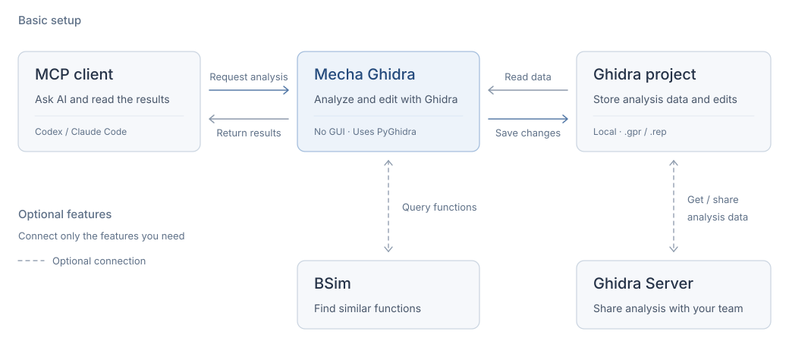

# Mecha Ghidra

A Ghidra MCP server built for fully automated AI analysis and handing findings back to human analysts. It runs independently of Ghidra plugins and lets the LLM compose low-level tools into an analysis workflow.

[English](README.md) | [日本語](README.ja.md) · [Get started](docs/usage.md) · [Tools](docs/tools.md) · [Releases](https://github.com/ghidra-user-jp/mecha_ghidra/releases)


## Design philosophy

- **Run independently of Ghidra plugins.** Mecha Ghidra is a standalone MCP server that accesses Ghidra APIs through PyGhidra. AI agents can automate project creation, analysis, editing, and saving without installing a plugin or operating the GUI.
- **Bring AI findings back to people.** Ghidra Server support lets an AI agent check in names, types, comments, and other edits to a shared repository. Human analysts can retrieve and review those changes in the Ghidra GUI and continue the analysis.
- **Keep context available for analysis.** Expose only the tools needed for the task, shorten tool descriptions, and retrieve or search large results in parts. These controls limit the context consumed by tool definitions and output. See [tool exposure](docs/configuration.md#tool-exposure) and [large results](docs/configuration.md#large-results).
- **Leave advanced analysis workflows to the LLM.** The server provides low-level operations such as decompilation, reference lookups, and name or type edits. The model forms hypotheses and chooses how to combine those operations. Keeping analysis workflows out of the server lets the project benefit from improvements in LLM capabilities.

<picture>
  <source media="(prefers-color-scheme: dark)" srcset="docs/assets/architecture.dark.svg">
  <source media="(prefers-color-scheme: light)" srcset="docs/assets/architecture.svg">
  
</picture>

## What you can do

- **Analyze binaries:** decompile and disassemble functions, inspect imports, strings, memory, and cross-references.
- **Record findings:** rename symbols, edit types and comments, undo changes, and export programs.
- **Compare programs:** keep multiple named targets open and search a BSim function database.
- **Work with a team:** check out, save, and check in programs through Ghidra Server.
- **Control context size:** retrieve large results in pages or search within them.

Local analysis works without Ghidra Server or BSim. Shared editing uses checkout/check-in; headless conflict merging is unsupported. See the [shared-project workflow](docs/shared-projects.md).

## Get started

Choose a setup:

| Setup | Start here |
| --- | --- |
| Ghidra is installed on your machine | [Local installation and first analysis](docs/usage.md#local-setup) |
| You want Ghidra bundled in a container | [Docker guide](docs/docker.md) |
| The server is already running | [Connect your MCP client](docs/clients.md) |

The local setup requires Python 3.10+, [uv](https://docs.astral.sh/uv/getting-started/installation/), Ghidra, and a compatible JDK. The repository's native builds currently target Ghidra 12.1.3. See [requirements and native decompiler files](docs/usage.md#requirements) before choosing a Ghidra distribution.

For an **existing** `analysis.gpr` project, this is the minimal stdio launch command. Replace both absolute paths:

```bash
git clone https://github.com/ghidra-user-jp/mecha_ghidra.git
cd mecha_ghidra
uv sync
export GHIDRA_INSTALL_DIR=/absolute/path/to/ghidra

uv run ghidra-mcp \
  --project-location /absolute/path/to/analysis.gpr \
  --transport stdio
```

Configure your MCP client to launch that command using the [client examples](docs/clients.md). After connecting, call `list_project_programs`, load a program with `load_project_program`, then use `list_functions` and `decompile_function`.

**Starting from a binary file?** Follow [first analysis](docs/usage.md#first-analysis): create a project, import the binary, then load it. Starting the server alone does not create a project or import a file.

## Documentation

| Guide | Contents |
| --- | --- |
| [Getting started](docs/usage.md) | Requirements, installation, first analysis, project concepts |
| [MCP clients](docs/clients.md) | Codex, Claude Code, Kilo Code, and stdio configuration |
| [Configuration](docs/configuration.md) | Transports, tool profiles, file access, large results |
| [Tool reference](docs/tools.md) | All tools, grouped by task |
| [Docker](docs/docker.md) | Build, volumes, first import, ARM64 |
| [Shared projects](docs/shared-projects.md) | Ghidra Server, checkout/check-in, conflicts, version history |
| [BSim](docs/bsim.md) | Similarity search, database registration, matched programs |
| [Troubleshooting and upgrades](docs/troubleshooting.md) | Error codes, common failures, renamed tools |
| [Development](docs/development.md) | Architecture, tests, native builds, releases |

## Contributing

See the [development guide](docs/development.md) for setup and required checks. For a bug report, include the Mecha Ghidra revision, Ghidra/Java versions, transport, a minimal reproduction, and the error code. Report issues through [GitHub Issues](https://github.com/ghidra-user-jp/mecha_ghidra/issues).

## License

[Apache License 2.0](LICENSE). Ghidra and other dependencies retain their own licenses.
