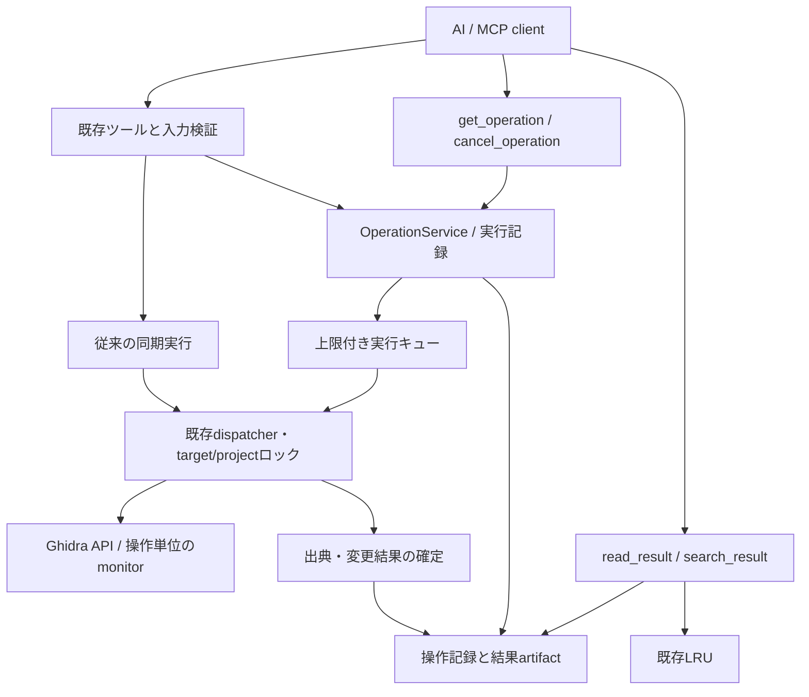
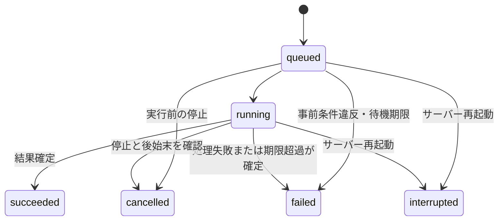

# AI向け実行基盤の拡張設計

2026-09-22。基準コミット: `d0eb93b7e210bb527d03ff7c6366f8c31ec31b68`。

**全体は設計案。重いbatch_readのみ実装済み。** 設計開始時に基準コミット、ローカルのMCP Python SDK 2.2.0、公式資料を確認した。第5章の逆コンパイル・逆アセンブル、時間・容量制限、C文字列の取得・検索を独立した変更として実装した。操作記録、ジョブ、source_id、構造化した復帰情報は未実装。現行の利用方法は[ツール一覧](tools.ja.md#batch-read)を参照。第2章は設計開始時の調査記録であり、その他の新しいAPI名・設定値・制限値は提案である。

## 1. 方針

AIが選んだ操作を、対象と状態を取り違えずに実行し、通信が途切れても実行結果を確認できるようにする。解析対象の選定、比較方法、仮説、次の操作はAIが決める。

対象は次の5点とする。

1. `batch_read`への逆コンパイル・逆アセンブル追加。
2. 操作IDと実行記録による結果照会・同一要求の二重実行防止。
3. インポート・解析などのバックグラウンド実行とキャンセル要求。
4. 結果に付随する対象識別情報・revision・アドレスの統一。
5. エラー時の実行・変更状態、未充足の条件、確認用ツールの構造化。

**操作とジョブは同じ実行記録を使う。結果の出典もこの記録と共通の型で表す。** ジョブは、受付と完了結果の取得を分けた操作であり、別の履歴管理システムを作らない。

エラーからの復帰も同じ実行記録・出典を使う。サーバーは確認できた状態と不足する条件を返し、条件を満たす方法や再実行の要否はAIが判断する。復帰手順の自動実行は追加しない。

既存の同期呼び出しを維持し、記録・バックグラウンド実行は明示指定で追加する。新しいMCPツールは原則として`get_operation`と`cancel_operation`の2つに絞る。結果の本文取得・検索には既存の`read_result`・`search_result`を拡張して使う。

独自の子プロセス管理、複数JVMの常駐ワーカー、自動保存・自動checkin、解析の自動再試行、複数操作をつなぐワークフローエンジンは今回追加しない。[既存の並列実行設計](project-worker-parallelism-design.ja.md)に従い、独立したエージェントの並列作業は既存Mechaプロセスを分ける。

## 2. 現行実装から引き継ぐもの

| 領域 | 確認した現在の動作 | 設計上の扱い |
| --- | --- | --- |
| `batch_read` | 同一targetの1〜20要求を要求順に実行。対応は5ツール。開始前・項目間・終了時にrevisionを確認 | 同一対象・逐次実行・一貫性検査を維持 |
| バッチ時間 | ロック取得後の時間予算。各項目の開始前に確認し、実行中の処理は打ち切らない | 新しい重い読み取りに限り協調停止を追加。既存の予算の意味を黙って変えない |
| デコンパイル | コンテキストの`DecompInterface`を再利用。単独呼び出しは120秒 | 共有インターフェースを並行利用しない。単独の既定値を維持 |
| 逆アセンブル | 関数または範囲指定。非連続な関数本体とseek cursorに対応 | 既存の選択条件とcursorを再利用 |
| 大きな結果 | プロセス内LRU。`result_id`は本文とtool・target等から算出 | 永続する操作の記録・結果と寿命を分ける |
| JSON部分取得 | 配列のルートまたは`/items`を取得。ネストしたC文字列の部分取得は未対応 | 明示した文字列pathの取得・検索を追加 |
| revision | `context.generation:Program.getModificationNumber()` | 比較は不透明な値の完全一致。永続する版番号やバイナリhashとして使わない |
| 変更 | `apply_edits`にbefore/after・atomic・dry run・expected_revisionがある | 再利用し、二重にトランザクションを開始しない |
| ロック | target/projectロック、operation/registryロック、プロセス全体のscript barrier | 既存の取得順と所有者を維持。ジョブが迂回しない |
| 初回load | 条件を満たす場合は自動解析・保存する | 単なる読み取りとして扱わない。初版のジョブ対象から除外 |
| HTTP | statelessなJSON応答。Ghidra状態と結果cacheはプロセスに保持 | HTTP接続やJSON-RPC IDを操作の識別子にしない |
| スキーマ | 入出力スキーマを公開し、最終的な構造化出力を検証 | 新しい受付・記録・出典の形も公開スキーマに含める |
| エラー | DomainErrorはcode・retryable・hint・detailsを保持。汎用fallbackにはmessageだけの応答もある。コード分類だけでは変更の有無は分からない | 実行境界で採取した事実を追加し、想定内エラーとfallbackの両方で保持 |

根拠: [batch_readコア](../src/ghidra_headless/handlers/commands/batch_read.py)、[バッチ契約](../src/ghidra_headless/contracts/batch_read.py)、[デコンパイラ](../src/ghidra_headless/handlers/core_helpers.py)、[クエリ](../src/ghidra_headless/handlers/commands/analysis_queries.py)、[revisionとcursor](../src/ghidra_headless/handlers/commands/query_support.py)、[結果ストア](../src/ghidra_mcp/presentation/result_store.py)、[変更処理](../src/ghidra_headless/handlers/commands/batch_edits.py)、[ランタイムの実行](../src/ghidra_mcp/infrastructure/ghidra_adapter/runtime/core_execution.py)、[loadとimport](../src/ghidra_mcp/infrastructure/ghidra_adapter/runtime/target_lifecycle.py)、[MCP境界](../src/ghidra_mcp/presentation/mcp_server.py)。

## 3. 共通の構成と不変条件



- 受付時の対象を実行時に別のProgramへ付け替えない。target名の再利用を検出する。
- 生きたProgramの出典と変更前後の状態は、実処理と同じ既存ロック区間で採取する。presentationでロック解除後に調べ直さない。
- バッチは単一Programの一貫したrevisionを対象とする。異なるProgramをまたぐ原子的なsnapshotは約束しない。
- 通信切断は操作の失敗・キャンセルを意味しない。再送は同じ`request_id`を使う。
- 実行の成功、Program内の変更、ローカル保存、repositoryへのcheckin、結果本文の取得成功を分ける。
- Ghidraと操作記録用DBを同時に原子commitできるとは扱わない。不明な結果は`unknown`として残し、自動再実行しない。
- 例外名・message・retryableから変更の有無を推測しない。未実行・rollback・変更済みの断定には、実行境界やtransaction・操作記録の根拠を必要とする。
- キャンセルは要求と停止完了を分ける。実行主体が動いている間はロック・Programの所有を解放しない。
- 受付と実行の両方で公開ツール・パス制限・checkout・read-only等の既存検査を通す。汎用の任意ツール実行APIは追加しない。
- 複数Mechaで実行記録DBや書き込み可能なローカルprojectを共有しない。HTTP接続がstatelessでも状態の所有者は固定する。

## 4. 対象と出典を表す共通モデル

### 4.1 識別情報

| 値 | 寿命・意味 |
| --- | --- |
| `server_id` | 操作記録ディレクトリに保存するインスタンスID。ディレクトリを共有して同時起動しない |
| `server_epoch` | プロセス起動ごとのUUID。再起動前の生きた状態と区別 |
| `target` | 利用者が指定する名前。これだけでは対象の同一性を保証しない |
| `target_generation` | targetの登録・Programのload/reload/rebindごとに変わるUUID |
| `project_id` | 正規化したローカルprojectを識別する内部ID。repository全体やバイナリのIDではない |
| `program_instance_id` | 開いているProgramオブジェクトの生存期間を識別。同じProgramを指す別targetで共有し、解放・再open後は別ID |
| `domain_path` | 取得時のproject内パス。異なるprojectに同じ値が存在できる |
| `revision` | 既存のrevision。再起動・再loadをまたぐ編集番号の大小比較をしない |
| `executable_sha256` | Ghidraが保持する元バイナリのhash。未取得ならnull。名前・型・コメントの変更や現在のpatch済みbytesを表すhashではない |
| `repository_version` | 確認できた共有版番号。Program内の未保存編集とは別に保持。該当しなければnull |

操作記録を有効にしていない通常実行では`server_id`もプロセス内IDでよい。永続性の保証は記録有効時だけとする。識別情報のためにProgramの非公開フィールドを読んだり、解析対象へ独自属性を書き込んだりしない。

共通の`SourceSnapshot`は上記に加えて、`tool`、意味を変えるquery、解決した関数entry・address space・範囲、取得時刻を持つ。名称は表示用とし、関数名だけを継続呼び出しの識別子にしない。インポートなどProgramがまだない操作は`source_kind="import_file"`とproject・入力fileのsnapshotを使い、Program関連値を偽造しない。

AIが事前条件として渡す値には`source_id`を使う。server_epoch・target_generation・program_instance_id・revisionを正規化して得たSHA-256とし、取得時刻・tool・queryは含めない。サーバーは現在の値から再計算して比較できるため、照合専用のcacheやその保持期限を増やさない。内部の詳細IDを毎回AIに組み立てさせない。

### 4.2 応答と参照の扱い

- 通常結果の`structuredContent.result`は維持し、その隣に`provenance`を追加する。単独デコンパイルの論理値は引き続きC文字列。
- 既存の`program`・`revision`を返すツールでは、新しい出典と同じsnapshotを使う。二つの値が食い違う応答を禁止する。
- バッチは共通のsourceと項目ごとのselectorを持つ。項目に巨大な共通metadataを複製しない。
- 通常の読み取りにはsource_id・target・program・revision・selectorを中心とした短い出典を付ける。hashや内部IDの詳細はget_program_info・操作記録で取得できるようにし、全項目へ同じmetadataを繰り返さない。
- `read_result`・`search_result`は、結果生成時の出典を引き継ぐ。cacheを読んだ時刻を「Programを観測した時刻」にしない。
- 既存の本文contentは維持する。構造化出力をAIへ渡さないクライアント向けには、出典を短い追加テキストとして表示する互換モードを別途検証する。metadataを足しただけで、全クライアントのAIが出典を見られるとは主張しない。
- 生きたProgramを読む境界では開始・終了のrevisionを確認する。途中で変化した場合は`SESSION_CHANGED`。チェックできない出力は`consistency="unverified"`として区別し、`verified`を付けない。
- 保存済みartifactは過去の観測として読み続けられる。現在のProgramと異なることを理由に過去の証拠を削除しない。

結果ストアのID算出には本文・tool・意味を変えるqueryに加え、対象のsnapshot識別情報を含める。同じtarget名・同じ出力文字列でも、別Programや別revisionなら別の観測として扱う。取得時刻だけではIDを変えず、同じsnapshotの同じ結果は重複保存しない。

### 4.3 編集前の検査

`expected_revision`は維持する。追加する`expected_source`には以前の応答に含まれるsource_idを指定する。AIは不透明な文字列としてそのまま渡す。初版は記録対象の`apply_edits`・`analyze_program`と拡張`batch_read`に限定する。

変更を行うapply_edits・analyze_programの初回記録付き実行では`expected_source`を必須とする。batch_readでは任意とし、省略時は固定したProgramの実行開始時のrevisionを読む。既存`expected_revision`も指定された場合は両方を満たす必要がある。queued状態でtargetをclose/reloadしたら、実行開始前に`SOURCE_CHANGED`として失敗させる。変更のなかった再loadでも新しいgenerationになるため、古い要求を新しい対象へ流さない。

既存ツールを無指定で使う場合の既定targetや既存revision検査は変更しない。importにはProgram用の`expected_source`を要求せず、project bindingと任意の`expected_input_sha256`を使う。

## 5. `batch_read`の重い読み取り対応

この章の機能は既存のtarget・revision・LRUを使って実装した。ジョブ用ExecutionContextに先行して、小さな`ReadBudget`で読み取りの期限だけを渡す。保持上限はmetadata・エラー用の余地を差し引き、compactなUTF-8 JSONとして計測する。Ghidra 12.1.3の専用projectで単独呼び出しとの一致、cursor継続、キャンセル済みmonitorからの復帰を検証した。

### 5.1 契約と制限案

既存の5ツールに`decompile_function`・`disassemble`を追加する。AIが指定した要求を同一target・同一projectロック内で順番に実行する。要求間の依存、別targetの混在、自動的な追加解析・再試行、同じデコンパイラへの並列呼び出しは追加しない。

| 制限 | 初期案 | 意味 |
| --- | --- | --- |
| 全要求数 | 1〜20 | 現行維持 |
| デコンパイル数 | 最大5 | 重いnative処理と巨大な結果を抑える。実機評価で調整 |
| 1デコンパイルの時間 | 既定15秒、1〜60秒 | 新しいバッチ専用`item_timeout_seconds` |
| バッチ全体 | 既存`timeout_seconds`、既定10秒、最大60秒 | ロック取得後から計測。重い処理はこの残時間も使う |
| ページ行数 | 合計2,000行 | xrefs・call edgesにdisassembleを加算。既定limitも加算 |
| 応答本文 | 既存`max_output_chars`、2,048〜12,000文字 | 既存どおりバッチJSON本文の上限。MCP全体やトークン数ではない |
| 保持する結果 | 合計8 MiB UTF-8を初期候補 | coreで項目ごとに計上する。応答文字数・LRU全体容量と別 |

`item_timeout_seconds`は要求オブジェクトのバッチ専用制御値とし、単独`decompile_function`の引数へ無条件に流さない。単独呼び出しの120秒、返却するC文字列、address優先等の既存条件を維持する。

### 5.2 時間とキャンセル

`ExecutionContext`にmonotonicな期限とキャンセルtokenを渡し、重い処理は`min(項目上限, バッチ残時間)`で実行する。既存のロック待機上限は別に適用する。

- デコンパイルには、その呼び出し専用のmonitorを渡す。nativeの秒単位timeoutだけでは端数を正確に表せないため、期限を確認するmonitorも使う。残時間が1秒未満なら新しいデコンパイルを開始しない。丸めによって`0`を渡し、無制限になる実装を禁止する。
- 逆アセンブルでは命令の列挙・変換中にも期限とキャンセルを確認する。中断したページを完全なページとして返さない。初版は項目全体をエラーにし、途中のcursorを新しく発明しない。
- 項目だけの期限超過で停止が確認できれば`DECOMPILE_TIMEOUT`等の項目エラーとし、残り時間がある限り続行できる。バッチ期限超過後は未開始項目を`not_run / time_budget_exhausted`にする。
- Programのrevision変更、sessionの入れ替わり、JVM/Programの健全性を確認できない失敗はバッチ全体を失敗させる。異なる状態の結果をpartialとして混ぜない。
- 正常なtimeout・cancel・native失敗後のdecompiler再利用可否を検証し、必要なら既存のreset経路を通す。タイムアウト用のスレッドが後から次の呼び出しを止めないよう、項目専用monitorと終了処理を使う。
- **期限は協調停止の予算であり、厳密な実時間の上限ではない。** Ghidra/JNI処理が戻らない間は実行中として扱い、ロックを解放して次の操作を開始しない。

Ghidraの公開APIは`decompileFunction(function, timeoutSecs, monitor)`を持つ。[DecompInterface](https://ghidra.re/ghidra_docs/api/ghidra/app/decompiler/DecompInterface.html)。monitorのcancelとcheckを実処理へ接続する必要がある。[TaskMonitor](https://ghidra.re/ghidra_docs/api/ghidra/util/task/TaskMonitor.html)。実際のGhidra同梱版での動作確認を実装前の条件とする。

### 5.3 出力量と本文取得

`fields`はdisassembleの命令行に適用し、`program`・`revision`・`has_more`・`next_cursor`を落とさない。C文字列への`fields`は入力時に拒否する。

応答上限を超えた場合は既存のバッチmanifestを使う。ただし巨大なC本文を保存後に読めるよう、以下を追加する。

```json
{
  "result_id": "0123456789abcdef",
  "mode": "text",
  "path": "/items/0/data",
  "offset_chars": 0,
  "limit_chars": 3000
}
```

これは提案する`read_result`の拡張。pathで選択したJSON文字列を復号し、その文字列の文字位置で分割取得する。JSONのエスケープ済み本文上の位置とは区別する。`search_result`にも同じpathを追加し、検索位置・続きのcursorは`result_id + path + pattern`に束縛する。

初版の文字列pathは`/items/<index>/data`に限定する。現行の`mode="json", path=""|"/items"`は維持する。配列全体を二重にdecodeせず、indexと選択した項目だけを処理する。検索時間、文字列長、index容量を既存予算へ算入する。

新しい8 MiB上限は、取得後に保持・serializeする総量を抑えるための値。Java側で単一デコンパイル結果が生成される瞬間のメモリ使用まで保証するものではない。1項目が上限を超えたら途中までのCを成功として返さず、`ITEM_RESULT_TOO_LARGE`と観測したsizeを返す。総量不足後の未実行項目は`not_run / result_budget_exhausted`とする。JSONエスケープ後の保存容量も別途検査する。

LRU保存に失敗した場合は、現行どおり`result_unavailable=true`を返す。記録付き実行では後述の永続artifactへ保存できるが、存在しない`result_id`を返さない。比較速度の改善はツール往復回数と解析計算時間を分けて測定する。

```json
{
  "target": "sample",
  "timeout_seconds": 30,
  "max_output_chars": 8000,
  "requests": [
    {
      "id": "callee",
      "tool": "decompile_function",
      "arguments": {"address": "00401000"},
      "item_timeout_seconds": 15
    },
    {
      "id": "caller_asm",
      "tool": "disassemble",
      "arguments": {"address": "00402000", "limit": 80},
      "fields": ["address", "mnemonic", "operands"]
    }
  ]
}
```

## 6. 操作IDと実行記録

### 6.1 APIの追加範囲

対象ツールへ次の共通オプションを追加する。未指定なら従来の同期実行を使う。

| 引数 | 契約 |
| --- | --- |
| `request_id` | クライアントが生成するUUID。指定すると記録付き実行。同じ操作の再送では変えない |
| `execution` | `sync`または`background`。既定は`sync`。backgroundにはrequest_idが必須 |
| `expected_source` | 変更対象の事前条件。4.3節に従う |

`request_id`はJSON-RPCのrequest IDとは別物。サーバーは受付時に別の`operation_id`を発行する。**どちらのIDでも照会可能にすることで、最初の受付応答が失われる場合も扱う。** HTTP接続やMCPセッションを越えて同じ実行記録を使う。

| ツール | 最初に有効にする記録・実行方式 | 範囲 |
| --- | --- | --- |
| `apply_edits` | 記録付きsync | 初版は`atomic=true`。dry runも記録できる |
| `batch_read` | 記録付きsync / background | 重い読み取りと結果artifactの検証後 |
| `analyze_program` | 記録付きsync / background | 解析完了・停止・rollbackの実機検証後 |
| `import_program` | 記録付きsync / background | 入力fileの固定、各import経路の停止・後始末の検証後 |

既存の個別rename等をすべて一度に対応させず、まず`apply_edits`を変更記録の入口にする。`atomic=false`、`run_script`、初回load、save/checkin、BSimへの書き込み、削除等は別途評価する。記録非対応のツールへ新オプションを付けたら入力エラーとし、記録したふりをしない。

追加する2ツールの契約は以下とする。

- `get_operation(operation_id | request_id)`：どちらか一方を必須とする。状態、対象、実行時刻、効果、エラー、結果参照を返す。待機せず、その時点の記録を読む。
- `cancel_operation(operation_id | request_id)`：停止要求を登録する。`accepted`・`cancel_requested`・現在状態を返す。すでに完了していれば`accepted=false, reason=already_terminal`。

認証を使う構成ではIDの検索・重複排除を同じ認証主体の範囲に限定する。匿名のローカル利用ではサーバーインスタンスを範囲とする。認可・ツール公開範囲の検査を再送・照会でも省略しない。

### 6.2 同じ要求を再送したとき

1. 入力の型・公開範囲を検査し、`request_id`の既存記録を検索する。
2. 既存記録があれば、受付時の契約に従って正規化したtool・引数のfingerprintを比較する。targetを現在のProgramへ解決し直して別操作にしない。
3. 同じIDで内容が異なる場合は`REQUEST_ID_CONFLICT`。同じなら実行中のreceipt、または確定済み結果を返す。
4. 初めてのIDだけ、対象を解決・固定し、事前条件を検査して受付記録を永続化する。
5. DBの一意制約と状態の条件付き更新により、同時再送でも実行主体を一つにする。

fingerprintにはtool、意味を変える引数、対象指定、事前条件、処理予算を含める。省略値は明示した既定値と同じになるよう正規化する。`request_id`・`execution`の応答待機方式・JSON-RPC IDは含めない。正規化の契約versionも保存する。互換な再送を判断できないversionでは照会を案内し、推測して再実行しない。

記録付き実行はtargetを明示させる。既存の記録に一致した再送は、現在のrevisionが変わっていても**過去の操作結果**を返す。今も同じ名前や型が残っているとは保証しない。`replayed=true`、実行時の出典、結果保存状態を付ける。

同期実行の初回完了時は既存の論理結果を返し、`structuredContent.operation`に記録の要約を追加する。background受付、またはまだ実行中の再送ではreceiptを返す。両形をoutput schemaへ明示する。完了済み結果の再送は元の成功・失敗を維持し、大きい本文はartifact参照で返せるようにする。

dry runの記録を再送しても実際の編集には切り替えない。内容を適用するときは新しいrequest_idと、dry run後に返った出典を使う。preview後にrevisionが進む可能性も扱う。

### 6.3 状態と変更結果



`cancel_requested`は状態と独立したフラグ。`phase`には`waiting_for_lock`・`executing`・`finalizing`等を持つ。running中でも、完了・失敗・キャンセルのどれになるかは実処理の戻り値と後始末を確認して決める。

| 記録する値 | 表すもの |
| --- | --- |
| `state` | 実行の状態。成功した受付と成功した解析を混同しない |
| `outcome` | `complete`・`partial`・`dry_run`等、tool固有の処理結果 |
| `effects` | `none`・`changed`・`rolled_back`・`partial`・`unknown`と、変更件数・対象 |
| `before` / `after` | ロック内で確認したSourceSnapshot。確認できなければnullと理由 |
| `persistence` | この操作がlocal save / repository checkinを行ったか。過去の保存状態と区別 |
| `result_status` | `pending`・`available`・`unavailable`・`expired`。変更の成否と別 |

Python例外が出なかっただけでは成功にしない。`apply_edits`の`rolled_back`・`dry_run_failed`等は処理失敗として記録し、正常なdry runは`succeeded / dry_run`とする。バッチの一部失敗は、現在の論理結果を保ちながら`outcome=partial`と項目別エラーを残す。将来`atomic=false`を対応させる際も、成功済み項目を消して「未実行」と扱わない。

batchの現行`status=ok/partial/error`は、それぞれ`succeeded/complete`・`succeeded/partial`・`failed`へ対応させる。batch内の読み取り予算を使い切ってpartialになる場合と、外側のジョブ期限超過・明示cancelは区別する。後者は停止確認後にfailed/cancelledとし、それまでに得られた項目を保存できれば部分結果として残す。

記録付きapply_editsは自動保存しない。`state=succeeded, effects=changed`でも、変更がメモリ内だけなら再起動で失われ得る。記録は「当時完了した」という履歴であり、現在のProgramの復元機能ではない。

### 6.4 確実に言える範囲

| 障害点 | 再起動後の扱い |
| --- | --- |
| 受付記録の永続化前 | Ghidraへdispatchしない。記録がないなら同じIDで受付できる |
| queuedを記録後、dispatch前 | `interrupted, effects=none`。自動再開しない |
| runningだが副作用開始前と確認できる場合 | `interrupted, effects=none`。ロック待ちを実行済みと扱わない |
| 処理開始を記録後、完了記録前 | `interrupted, effects=unknown`を基本とする。確認できたcheckpointは併記 |
| 完了記録後、応答送信前 | 同じIDの照会・再送で確定済み結果を返す |
| 本文artifactだけ消失・期限切れ | 実行状態は維持し、本文の取得不能を返す。操作を再実行しない |

変更を行う直前に「副作用を開始し得る段階」を永続化する。単なるロック待ちとの区別に使うが、その後はGhidraのtransactionと記録DBの間に不可避の隙間がある。**exactly-onceを保証せず、重複dispatchの抑止と、確定した結果・不明な結果の区別を保証する。**

不明な状態では同じIDを再送しても再実行しない。AIが対象を読み直して変更の有無を確認し、必要なら新しい事前条件と新しいIDで別操作を依頼する。サーバー側でrenameの推測復旧や自動再試行をしない。

## 7. 長時間処理の実行方式

### 7.1 既存プロセス内の実行キュー

ジョブ用の小さな実行キューをapplication層に追加する。実処理は既存のthread実行・dispatcherへ渡し、同じJVMとProgramを使う。初版はジョブworkerを1本、待機数を最大16件とする案。上限超過は`OPERATION_QUEUE_FULL`を返す。並列度を増やす設計判断は今回に含めない。

記録付きsyncも同じ実行主体へ委譲し、呼び出し元は完了を待つ。接続切断やリクエストのcancelで失うのは待機だけとし、ジョブを所有するタスクは停止させない。明示的な停止は`cancel_operation`から行う。通常の記録なしsyncの動作は変更しない。

`get_operation`・`cancel_operation`は制御用の経路で処理し、Ghidra処理のthread枠・target/projectロックを待たせない。DBと短い状態ロックだけを使う。DBロックを持ったままGhidraロックを取得しない。

受付時は対象のbindingを固定し、Programを新たにopenしない。実行時に既存ロックを一度だけ取得し、binding・事前条件・checkout・quarantineを再検査する。出典と効果の採取hookは既存executorのロック区間へ置く。ジョブ専用の迂回実行経路や二重ロックは作らない。

キュー待機、ロック待機、実処理の予算を区別して記録する。外側の実行予算を指定する場合は`run_timeout_seconds`とし、既存`batch_read.timeout_seconds`と混同させない。初期候補は解析・importが既定600秒、サーバー上限3,600秒。待機予算は別のサーバー設定とし、実データによる評価で確定する。

ロック待ちの停止要求は即座に受付できても、既存のロック取得が戻るまではrunningのままになる場合がある。取得後・副作用開始前に必ずtokenを確認し、cancel済みの処理を開始しない。既存ロックの待機上限を超えて無期限に待たせない。

実処理の期限超過はmonitorへ停止要求を出す。停止確認後に`failed / EXECUTION_DEADLINE_EXCEEDED`とし、効果・rollbackの結果を別記する。戻ってこない間はrunningのまま`cancel_requested=true, cancel_reason=deadline`と経過時間を返す。「タイムアウトしたから別threadで同じProgramを再使用する」実装を禁止する。

進捗はmonitorから得た値とphaseだけを返す。意味の分からない合成百分率は出さない。`poll_after_ms`の初期値は1,000〜5,000とし、通知に対応しないクライアントでも照会だけで完結させる。

### 7.2 解析・importのキャンセル

現在の`HeadlessContext.monitor()`は`TaskMonitor.DUMMY`であり、解析のFlatProgramAPIもcontextの初期化時に生成している。別のmonitorへcancelを送るだけでは実処理は止まらない。[現在のcontext](../src/ghidra_headless/handlers/core_runtime.py)。

操作専用monitorを実際のdecompiler・analyzer・loader・saveへ渡す。共有DUMMYや次の操作で使うmonitorをcancelしない。monitorはstdoutへ進捗を出さず、stdio MCPのプロトコルを壊さない。

- 解析：利用するGhidra版の公開APIでmonitorを解析処理へ接続できること、解析用threadの停止、transaction終了、`markProgramAnalyzed`の条件を確認する。途中cancelで成功・解析済みと記録しない。
- import：auto import / raw binary / 追加解析 / 保存 / loader結果解放の各経路へ接続する。既存の失敗時削除・cleanup失敗の報告を維持する。作成済みDomainFileや保存のcheckpointを記録する。
- cancelと完了が競合したら、確定した実処理の結果を優先する。停止要求が先に届いていても、すでに保存・完了していればsucceededになる場合がある。
- 削除で後始末する場合は、その操作が作成した新規資源だと確認できる範囲に限定する。既存ファイルや完了したimportを、遅れて届いたcancelで削除しない。

停止・rollbackを実機で証明できない経路は`cancel_supported=false`として明示する。初版から強制停止を約束しない。停止不能時のProgram所有とquarantineは既存ランタイムの方針を維持する。

### 7.3 キュー中の入力file

importは受付時のパスだけ記録すると、実行までに中身が変わり得る。受付時にはpath制限・project binding・import optionsを固定し、workerが実行前に入力をprivateなstaging領域へコピーしてhashを計算する。コピー前後のfile状態を確認し、変化を検出したら失敗させる。Ghidraへ渡すのはそのsnapshotとする。

`expected_input_sha256`が指定された場合はsnapshotのhashと照合する。未指定なら「受付時点のbytes」ではなく「実行前に固定したbytes」であることを出典に記録する。コピー元の名称・拡張子と明示的なimport名を維持し、stagingのUUIDをProgram名にしない。入力hash、実際のDomainFile、返却されたProgramのhashをそれぞれ区別する。

stagingの容量・コピー時間・cancel・起動時cleanupも予算へ含める。stagingによって外部依存の探索やloaderの挙動が変わる形式は、同等動作を検証するまでbackground import対象に含めない。既存の同期importの入力方式は変えない。

### 7.4 終了と再起動

正常終了では新規受付を止め、実行中処理に終了猶予と停止要求を与える。止まらない処理を完了扱いにせず記録を残す。再起動時は旧epochのqueued/runningをinterruptedにし、自動再開しない。queuedは未実行、実行開始後は確認できる範囲の効果とunknownを区別する。

再起動後も同じ記録ディレクトリならID照会できる。完了済みの記録と結果は読めるが、開いていたProgramや未保存の編集を復元する機能は今回作らない。

## 8. 記録と結果の保存

### 8.1 永続化の境界

`--operation-state-dir DIR`を新設し、記録付き実行を明示的に有効にする案とする。未設定なら追加オプションは`OPERATION_STORE_DISABLED`、通常の同期ツールは現行どおり使える。設定したディレクトリには次の3種類だけを置く。

- SQLiteの操作記録：要求のfingerprint、固定した対象、状態遷移、効果、結果参照、保存期限。
- 結果artifact：上限付きの本文。ProgramやJVMオブジェクトをpickle化しない。
- import staging：実行前に固定した入力。終了後の削除対象。

初版はローカルディスクに限定し、起動中はディレクトリの排他所有を検査する。SQLiteのdurable commitを使い、受付を永続化する前に実行しない。ファイル権限はディレクトリ0700・ファイル0600を基本とする。プログラム内容や編集内容を通常のログへ複製しない。

結果保存ではtempへ書く、flush/fsyncする、atomic renameする、DBから参照する順序を守る。起動時に孤立したtemp/artifactを回収する。本文の保存失敗を操作の未実行と扱わないため、**小さな実行結果・効果の記録を本文より先に確定できる構成**にする。

効果が確定した時点でterminalな実行状態と`result_status=pending`を記録し、その後本文を保存してavailable/unavailableへ変える。途中で落ちた場合は実行状態を維持し、残ったartifactを検査して本文状態だけを復旧する。状態と本文の両方が確定するまで応答できない設計にしない。

完了状態そのものをDBへ保存できなかった場合は、記録サービスを不健全として新規受付を止める。接続が残っていれば`JOURNAL_WRITE_FAILED`と確認済みの効果を返すが、永続記録済みとは表示しない。再起動後は最後に確定した記録からinterrupted/unknownを返す。

### 8.2 LRUとの関係・保持期限

通常の読み取りは現行LRUを使い続ける。記録付き実行の本文は永続artifactへ置き、`read_result`・`search_result`は共通のresolverでどちらも参照する。永続artifactを読むためにLRUへ再登録する必要はない。

既存のresult_id形式を保ち、内容と出典のdigestから算出する。保存時に完全なdigestも検証し、短縮IDが衝突した場合は別IDを発行して既存結果を上書きしない。artifactの所有者・出典・mime・長さ・indexの整合性を確認する。

保持の初期案は本文24時間、詳細な実行記録7日。レスポンスへ実際の`result_expires_at`を返す。期限切れの本文は`RESULT_EXPIRED`とし、記録のstateや効果は消さない。処理中の記録・本文をcleanupが消さないよう、読み取りleaseとactive参照を持つ。

重複実行を避けるため、詳細を縮約した後も`request_id`・fingerprint・operation_id・terminal状態・効果の最小要約をtombstoneとして残す。**本文の期限切れはrequest_id再利用の許可にしない。** tombstoneはインスタンス存続中は自動削除しない。記録件数・disk上限に達したら新規受付を拒否し、古いIDを黙って再利用可能にしない。

運用者が記録ディレクトリを明示的に破棄した場合は新しいserver_idとなり、旧IDについての保証は失われる。クライアントはserver_idの変更を確認し、旧要求を新しいサーバーへ無条件に再送しない。本文・staging・DBを含むdisk容量上限と、1要求の入力・結果上限をそれぞれ設定できるようにする。

## 9. 呼び出し例

以下は提案するAPIの例。IDとrevisionは説明用の値である。既存の`get_program_info`の応答へprovenanceを追加し、初回の`expected_source`を取得できるようにする。`list_targets`にもtarget_generationとProgramのload状態を加える。初版から新しい探索ツールは追加しない。

AIが関数名を変更する。`apply_edits`の引数例：

```json
{
  "target": "sample",
  "request_id": "70bf7bfe-c20d-45bc-9dac-486c784a9e54",
  "execution": "sync",
  "expected_source": "537b97d844cd449c7c0f986ac53bcf20e8182a9f02eb8450e30f3f7edb296a2a",
  "atomic": true,
  "edits": [
    {"kind": "rename_function", "address": "00401000", "new_name": "decode_config"}
  ]
}
```

応答が失われたら、同じ要求を再送するか、`get_operation`へ次を渡す。

```json
{
  "request_id": "70bf7bfe-c20d-45bc-9dac-486c784a9e54"
}
```

照会結果の要約部分の例。実際のoutput schemaではserver_id・対象snapshot・時刻も返す。

```json
{
  "operation_id": "8b62c87d-4eb4-49a7-87cb-06b3b560c839",
  "state": "succeeded",
  "outcome": "complete",
  "effects": {"status": "changed", "applied_count": 1},
  "persistence": {"local_save_performed": false, "repository_checkin_performed": false},
  "result_status": "available",
  "result_id": "0123456789abcdef",
  "cancel_requested": false
}
```

解析をジョブとして開始する場合も、既存の`analyze_program`にtarget、新しいrequest_id、`execution="background"`、expected_sourceを渡す。同じ形式のreceiptを即座に受け取り、get_operationで状態を確認する。結果が大きければread_resultへ進む。比較する対象や次に読む関数を、この状態遷移からサーバーが自動選択することはない。

get_operation自体が成功しても、その中の操作はfailedの場合がある。照会ツールの`isError`は照会不能を表し、元の処理の成否は`state`と`operation_error`で読む。元の変更ツールを再送した場合は、元の処理エラーを維持する。この区別を短いツール説明とserver instructionsに含める。

## 10. エラーからの復帰を分かりやすくする

優先度は高とする。操作記録を使わない既存の同期呼び出しにも適用し、記録対応ツールでは6節の情報をそのまま引き継ぐ。エラー専用の履歴や新しい復帰ツールは作らない。

### 10.1 現行のエラー形式を拡張する

既存の`code`・`message`・`retryable`・`hint`・`details`を維持し、`structuredContent.error`へ以下を追加する。`recovery`の契約は独立した共通型として公開し、各ツールが異なる名前で同じ意味の項目を増やさない。

| 項目 | 契約 |
| --- | --- |
| `execution` | `started: true/false/null`、失敗したphase、記録があればoperation_id・request_id・state。nullは未確認でありfalseではない |
| `effects` | 6.3節と同じ`none / changed / rolled_back / partial / unknown`。この操作が及ぼした効果であり、Program全体のdirty状態ではない |
| `recovery.retry` | 再送の扱いを`mode`と`request_id_policy`で示す。10.3節の契約を使う |
| `recovery.preconditions` | 条件ごとの`kind`、`status=unmet/unknown`、確認できたexpected・observed。未確認の条件を満たされていないと断定しない |
| `recovery.verification_tools` | 確認に使える公開済みツールのtool・arguments・purpose。呼び出し順や分岐は指定しない |

取得できた出典は既存設計の`provenance`へ、変更前後の出典は操作記録のbefore/afterへ置く。エラーの中へ同じsnapshotを複製しない。出典を取得するために失敗後のロックを取り直して応答を遅らせない。

実行状態と効果は別軸とする。例えば実行前の拒否は`started=false, effects=none`、処理後のrollbackは`started=true, effects=rolled_back`。単なる通信切断からこのどちらかを作らず、応答がなければ既存request_idで記録を照会する。

startedは要求した実処理の開始を表し、workerの起動や受付処理の開始とは区別する。失敗した操作のstateがfailedでも、開始前検査で止まったならstartedはfalseになる。条件のkindはsource_matches・checkout_held・writable_program・input_valid等の共通識別子として定義し、自由文は説明だけに使う。

効果の範囲が複数ある場合は`effects.scopes`にProgram・project・repository・external等の確認結果を分ける。scriptのProgram内のrollbackを根拠に外部ファイル等も未変更とは扱わない。必要な範囲が不明なら全体のstatusはunknownとし、判明した範囲の結果を残す。

### 10.2 状態は実行箇所で記録する

- 入力検証・公開範囲・開始前ロック取得で止まったと確認できる場合は未実行。単に例外がValueErrorやLOCK_TIMEOUTであることを根拠にしない。
- transaction終了・cleanup・保存の実処理から効果を受け取る。revisionの増加だけでは変更の確定、同じrevisionだけでは外部副作用の不存在を証明しない。
- 予期しない例外でも、すでに確定した効果やoperation_idを汎用エラーへの変換で失わない。実行情報がないfallbackは`started=null, effects=unknown`を基本とする。
- エラーを整形・圧縮・schema検証する段階で失敗しても、判明している変更をnoneへ戻さない。最小のfallback応答にcode、実行状態、効果、照会IDを保持する。
- 6節の履歴とエラーで別々に成否を計算しない。同じExecutionContextと効果の記録から生成し、記録付き実行ではその時点の確定済み情報を使う。

現在の[to_domain_error](../src/ghidra_mcp/domain/error_mapping.py)はDomainErrorを再構築し、HeadlessErrorのdetailsも一部コードだけ引き継ぐ。追加する型付きの実行情報はこの経路で常に保存し、任意の内部detailsを無制限に公開する変更にはしない。[公開エラー変換](../src/ghidra_mcp/presentation/error_mapper.py)では既存の内部情報のマスクを維持する。

### 10.3 再試行の意味を分ける

| `recovery.retry.mode` | 意味 |
| --- | --- |
| `same_request` | 対象・引数を変えずに再送可能と確認できた。短い待機が必要ならretry_after_msを付ける |
| `after_conditions` | 未充足の条件がある。同じ要求の連続送信では解決しない |
| `inspect_first` | 対象の入れ替わり、部分変更、不明な効果等を先に確認する必要がある。再実行可能とはまだ判定していない |
| `never` | 元の処理を繰り返す理由がない、またはそのままの再実行を認めない。結果照会や引数を修正した別操作まで禁止する意味ではない |

`request_id_policy`は`reuse / new / not_applicable`とする。reuseは同じ要求の再送に元のIDを使うこと、newは確認・条件解消後に別操作として実行するとAIが判断した場合に新しいIDが必要なことを表す。記録を使っていなければnot_applicable。policyだけを根拠に確認前の新IDで実行しない。

同じIDの再送による**記録の再取得**と、処理の再実行を区別する。terminalな記録があれば同じIDはその記録を返し、エラーが解消しただけでは再実行しない。runningならget_operationで照会する。不明な記録の同じIDでの照会・再送は可能だが、そのことを処理の`retryable=true`と表現しない。

terminalな記録がある場合は、未実行の失敗でもsame_requestにしない。条件解消・確認後の再実行が必要ならnew、元の処理を再実行する理由がなければnot_applicableとする。記録のない開始前の失敗は、処理予算と対象条件が許す範囲でreuseによる再送を案内できる。

`retryable`は既存クライアント向けに残す。ただし、新しい応答では`mode=same_request`の場合だけtrueにする。現行の分類がtrueでも、実行情報から確認や条件解消が必要ならfalseへ狭める。特にSESSION_CHANGEDの無条件再送を促す文言は、この構造と一致するように見直す。フィールドの型・codeを保ち、値の保守的な変更は互換性テストと変更記録に含める。[現行のコード分類](../src/ghidra_mcp/domain/error_codes.py)。

`hint`は同じ構造から作る短い説明とし、構造化した制約と矛盾する「retry」等を別の固定文から付けない。条件の修復、待機、別ツールの選択をサーバーが自動実行する仕組みは作らない。

### 10.4 確認用ツールの選び方

verification_toolsは「不足している事実を調べるための候補」であり、復帰ワークフローではない。get_operation、get_program_info、get_function、get_project_sync_status、list_targets、list_project_programs、read_result等から、実装を確認した読み取り操作だけを選ぶ。readOnlyHintだけを根拠に任意ツールを載せない。

候補は既存ToolSpecと公開設定に照らして検証し、引数は失敗した要求・固定した対象・記録から確実に得られる値だけを使う。非公開ツールを呼ぶよう案内せず、型の合わない引数、存在しないoperation_id、別のtargetへ解決した引数を作らない。targetが入れ替わった可能性がある場合は、現在の対象を確認する候補であることをpurposeに示す。

引数の検証には、公開名への変換とtargetの注入を反映したpublic input schema/modelを使う。内部のToolSpec.input_modelだけでは実際のMCP引数を検証できないため、公開ツールと同じ生成経路を再利用する。

条件解消に変更が必要でも、checkout、load、discard、delete、undo、checkin等を確認用ツールへ混ぜない。特に既存loadには解析・保存の可能性がある。既存のhintにある変更系の案内も、無条件に実行する指示として提示しない。

適切な読み取りツールが公開されていない場合は空配列と`inspection_unavailable_reason`を返す。運用者の対応が必要と確認できた場合だけ`operator_action_required=true`を付ける。確認呼び出し自体の成功や、すべての不明点をMCP経由で解消できることは保証しない。

初期上限は条件8件・候補3件とし、重複する出典・診断本文を省く。省略した場合はomitted_countを付け、空配列を「条件はすべて満たされている」の意味で使わない。巨大な診断を既存の結果ストアへ退避しても、実行状態・効果・再試行方針・照会IDの最小情報は応答内に残す。

### 10.5 応答例と代表的な失敗

記録付きapply_editsが受付後、実行直前のcheckout検査で拒否された場合の`structuredContent`例。request_id・operation_idは説明用の値。開始前検査で変更はなく、条件を満たした後の実行には新しいIDが必要になる。

```json
{
  "error": {
    "code": "CHECKOUT_REQUIRED",
    "message": "Checkout is required for this edit.",
    "retryable": false,
    "hint": "Inspect the checkout status before deciding how to proceed.",
    "execution": {
      "started": false,
      "phase": "precondition_check",
      "state": "failed",
      "operation_id": "b45fcf7e-0f84-4e1c-bb42-4eff793c83b0",
      "request_id": "a921b6e8-4b01-48b2-9f70-2344db27f7dc"
    },
    "effects": {"status": "none"},
    "recovery": {
      "retry": {"mode": "after_conditions", "request_id_policy": "new"},
      "preconditions": [
        {"kind": "checkout_held", "status": "unmet", "expected": true, "observed": false}
      ],
      "verification_tools": [
        {
          "tool": "get_project_sync_status",
          "arguments": {"target": "sample", "domain_path": "/sample.exe"},
          "purpose": "Inspect the current checkout status."
        }
      ]
    }
  }
}
```

| ケース | 実行・効果の扱い | 復帰情報 |
| --- | --- | --- |
| 入力検証で拒否 | 未実行・none | 引数の条件違反。after_conditions。dispatchしていない根拠が必要 |
| 記録なし読み取りの開始前LOCK_TIMEOUT | 未実行・none | 安定した対象で同じ要求を送れる場合に限りsame_request。待機時間は推定できる場合だけ返す |
| SOURCE_CHANGED / SESSION_CHANGED | 発生phaseに従う。開始前ならnone、処理開始後は既存の記録を参照 | inspect_first。対象とsource_idを確認し直す。新しい値への自動差し替えはしない |
| 変更後に応答の整形だけ失敗 | 操作はsucceeded、確認済みのchangedを維持 | 元の変更はnever。get_operation等で結果を確認。従来の成功＋result_unavailableの形も維持 |
| クラッシュ後のinterrupted | 最後に確定した開始・効果の記録を使用。unknownを未実行へ変換しない | inspect_first。操作記録と現在の関数・Program状態を必要に応じて確認 |
| importのcleanup失敗 | 作成・保存済み資源のcheckpointからpartial/unknown | inspect_first。作成済みDomainFileを確認し、再importを自動で促さない |
| RESULT_EXPIRED | 取得要求は失敗しても、元の操作の成否・効果は別 | 取得の反復はnever。元の変更も再実行しない。新たな読み取りが必要かはAIが判断 |
| SCRIPT_TIMEOUT | Program内のrollbackと外部への効果を分ける | 効果が未確認ならinspect_first。全体をnoneとして自動再試行しない |

### 10.6 応答全体・項目エラー・履歴を揃える

通常のツール失敗、batchの項目エラー、get_operationの`operation_error`で同じRecovery型を使う。項目エラーはrequestのidをscopeとして持ち、先行項目や操作全体の効果と混同しない。6.3節のstatus対応は維持し、エラー情報の追加だけで正常なpartialを全体失敗へ変えない。

get_operationやread_resultの呼び出し自体が失敗した場合、そのエラーの対象は照会・取得要求である。元の操作の効果を照会失敗から推測しない。照会に成功して元の操作がfailedだった場合は、9節どおりoperation_errorに失敗を載せ、照会ツール自体のisErrorは立てない。

保存するエラーの事実は実行時のものとして不変にする。verification_toolsはその事実から、照会時の公開設定に合わせて再生成する。過去の失敗理由を書き換えず、非公開になったツールの候補だけを除く。

構造化出力と短いテキスト表現で同じ事実を伝える。既存の[大きなエラーの圧縮](../src/ghidra_mcp/presentation/result_errors.py)、[汎用fallback](../src/ghidra_mcp/presentation/tool_binding.py)、[出力検証](../src/ghidra_mcp/presentation/mcp_server.py)、[output schema](../src/ghidra_mcp/presentation/response_schemas.py)をまとめて更新する。段階移行中に新しい情報がない応答は未対応として扱い、フィールド不在を未実行・未変更と解釈しない。

## 11. MCP標準Tasksとの関係

MCPのTasks拡張は将来の接続先とし、今回の実行基盤の必須依存にしない。確認したローカルSDKは2.2.0で、公式Python SDKの[ROADMAP](https://github.com/modelcontextprotocol/python-sdk/blob/main/ROADMAP.md)でもTasks extensionの実装は未完了として扱われている。導入時にSDK・クライアント対応を再確認する。

現行の[2026-07-28 Tasks仕様](https://tasks.extensions.modelcontextprotocol.io/specification/2026-07-28/tasks)では、対応クライアントに非同期handleを返して照会・停止できる。将来のadapterは同じOperationServiceへ接続し、二つ目のキューや記録DBを作らない。旧仕様の`tasks/result`・`tasks/list`を新規設計の前提にしない。

Mechaの操作失敗とTasksのprotocol failureは区別する。通常のtool errorはTasksのcompleted resultに含める形になるため、内部のfailedをそのままprotocolのfailedへ写さない。クライアントとの交渉、状態の対応付け、結果の保持契約をadapterの契約テストで検証する。

## 12. 実装の分割

優先度が高いbatch対応とエラー復帰の共通契約を先に提供し、変更記録・ジョブで同じ対象・効果モデルを使える順に分ける。

| 段階 | 成果物 | 完了条件 |
| --- | --- | --- |
| A1（実装済み） | 既存target/revisionを使うbatchの2ツール追加、時間・容量制限、文字列path取得・検索 | 現行出力互換、revision検査、予算・取得、Ghidra実機での復帰検証 |
| A2 | SourceSnapshot・効果・Recoveryの共通型、既存syncのエラー拡張 | 未実行/unknownの区別と確認候補の検証 |
| B | 共通executorと永続OperationStore、get_operation、記録付きapply_edits、エラーと履歴の接続 | 同時再送・応答消失・クラッシュの境界で二重dispatchせず、効果・再試行方針が一致 |
| C1 | 同じexecutorのbackground公開、batch対応、cancel_operation | 接続切断からの独立、制御経路の応答、queue上限、停止確認、項目エラーとoperation_errorの整合 |
| C2 | analyze_programのbackground | 実際のmonitor接続、解析thread終了、rollback/dirty状態を検証 |
| C3 | import_programのbackground | 両import経路、入力snapshot、保存・cleanupの部分失敗を検証 |
| D | その他ツールへの出典付与、対応範囲の拡大 | 通常result・cache・script等の検証可能性を区別 |

MCP Tasks adapterはSDK対応後の独立した追加作業とする。A〜Cを待たせない。段階Bではcancel_operationをまだ公開しなくてよい。公開するツールは、その時点で使える機能に限る。

変更候補の配置は既存の依存方向に合わせる。[開発ガイド](development.ja.md)を参照。

| 層 | 配置案・主な変更 |
| --- | --- |
| contracts / domain | `SourceSnapshot`、操作状態・効果・receipt、Recoveryと事前条件、ExecutionContextのJVM非依存部分 |
| application | `OperationService`、上限付きqueue、OperationStore/ResultArtifactStoreのport、実行情報を保持するエラー変換 |
| infrastructure | SQLiteとartifact保存、起動時復旧、runtimeの出典・効果採取hook、操作monitorの接続 |
| ghidra_headless | batch allowlist、decompileの予算、命令列挙中の停止、コア側の重複入力検査、例外へ確定した効果を付与 |
| presentation | 公開ToolSpec/入力モデル、2制御ツール、受付/完了/エラーoutput schema、公開候補の検証、本文path取得とエラー圧縮 |

coreへSQLiteやMCP型を持ち込まない。applicationがpresentationのLRU実装へ直接依存しないよう、artifactのportを設ける。共通monitorをthread localだけに隠さず、実行contextを明示して下位処理へ渡す。新しいコア引数は既存の依存宣言とhandler/schema整合性テストへ反映する。

server instructionsには、AIの判断に必要な契約だけを追加する。対応ツール、記録の有効・無効、IDの再利用、状態確認、出典と結果の期限、retryableと復帰情報の読み方を短く示す。解析戦略や推奨する関数選択順序は組み込まない。

## 13. 実装時の検証項目

| 領域 | 必須のケース |
| --- | --- |
| 重いbatch | 既存5ツール互換、最大件数・行数、軽い項目と混在、項目timeout/全体timeout、残1秒未満、途中revision変更 |
| decompiler | 正常完了・timeout・cancel・native失敗の後に同じtargetで次の呼び出しが正常に動くこと |
| disassemble | 非連続body、関数/範囲selector、cursor、fields、列挙途中のcancelを完全なページと誤認しないこと |
| 本文取得 | 日本語・改行・エスケープ文字を含むC、path検索cursor、巨大1項目、LRU拒否、artifact期限切れ、ID衝突 |
| 重複排除 | 同じIDの同時送信、内容違い、初回応答消失、完了後の対象変更、詳細記録縮約後、旧epochからの再送 |
| 障害注入 | 受付commit前後、dispatch直前、Ghidra変更直後、結果記録直前、artifact保存途中、disk満杯・DB書込失敗 |
| 出典 | 同名target再利用、同一Programの別target、close/reopen、import未完了、cache読取後に現在revisionが変わる場合 |
| ジョブ | queue上限、queued cancel、ロック待ちcancel、running cancel、完了との競合、HTTP切断、再起動で自動再開しないこと |
| 解析・import | monitorが実処理に届くこと、解析threadの残留、rollback、途中保存、cleanup失敗、コピー中の入力変更 |
| エラーの事実 | 検証前/実行前/実行後の失敗、同じcodeで異なるphase、Programのrollbackと外部副作用、効果不明をnoneにしないこと |
| 復帰情報 | 公開ツールと引数schema、未知・非公開・変更系ツールを候補にしないこと、sourceの入れ替わり、retryableとhintの一致、新旧request_idの扱い |
| エラーの伝達 | DomainErrorの再構築、汎用例外、整形/schema失敗、巨大エラーとcache拒否、batch項目、operation_error、取得失敗で元の効果を失わないこと |
| 互換性 | stdio/HTTP、contentのみ/structuredContent対応のclient、公開profileと子ツール非公開、出力schema検証 |

Pythonの単体テストだけではGhidra処理の停止・rollbackを証明できない。実装時は通常テストと、対応Ghidra版を使う実機テストを分けて実施・記録する。現在の実装・検証対象はA1であり、他の設計項目を通過済みとは扱わない。

未確定なのは、8 MiB等の初期制限値、解析・loaderごとのキャンセル可能範囲、各クライアントの出典表示。いずれも実装中の計測・互換性検証で確定する。解析の方針をAIが決めるという責務分担は、これらの値に依存しない。
