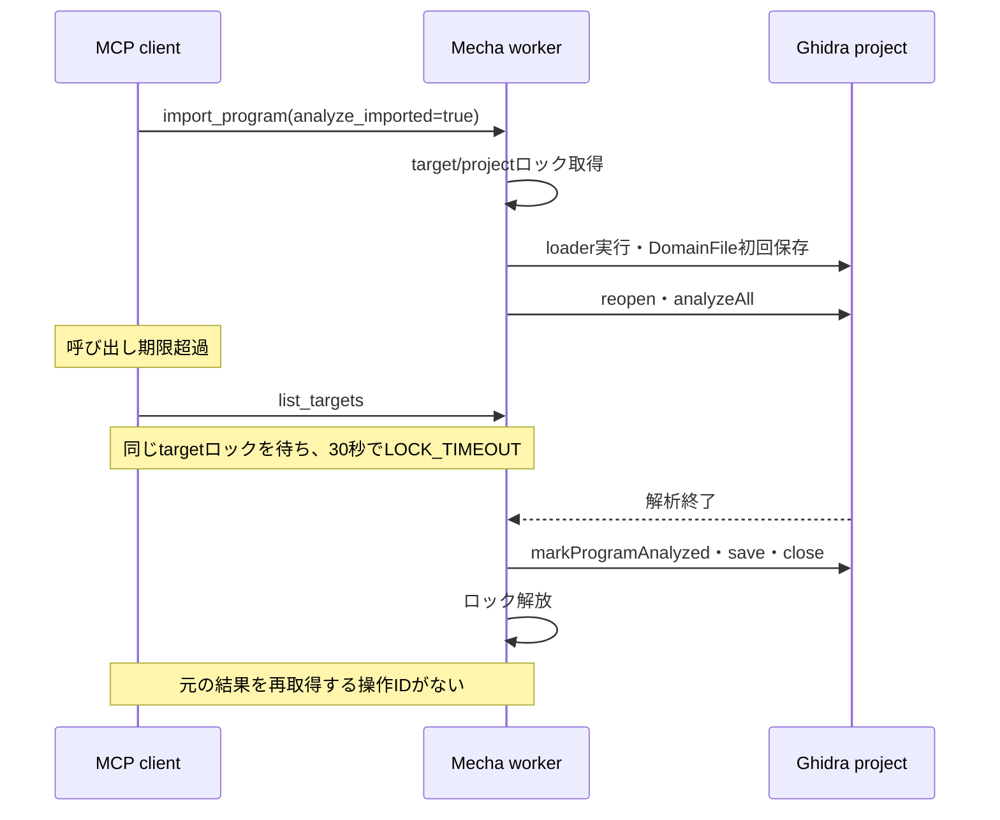
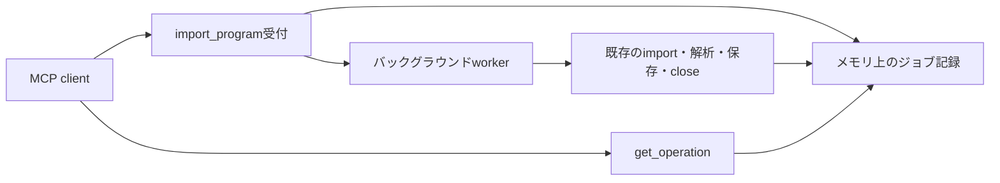

# import_programの非同期化と結果追跡の設計

2026-09-23。調査基準: `3c8e6840efa9958fbb03ae319b0afbcb199d5040`（main）。2026-09-24改訂: サーバー側で待つ照会、`request_id`の任意化、失敗後の出力状態の返却、停止時の解析キャンセルへ設計を改めた。

**改訂版の実装・検証記録。Codexのtimeout設定は変更していない。** メモリ上の管理だけにし、大掛かりにしない最小構成。ジョブIDは`operation_id`とし、import専用の小さな管理機能を追加する。[AI向け実行基盤の拡張設計](ai-execution-design.ja.md)の永続OperationStoreや汎用executorは今回の前提にしない。

## 1. 結論と確認範囲

300秒はGhidraの解析期限ではなく、CodexのMCP呼び出し待機期限で説明できる。修正前のサーバーは同期worker内でimport・analysis・save・closeを実行しており、呼び出し元の待機終了とGhidraの処理終了は連動していない。ロックは処理が戻るまで保持される。期限延長だけでは、延長後の超過、通信切断、受付応答の消失、再起動後の結果不明を解決できない。

採用する案は、**メモリへジョブを登録してジョブの記録を返し、サーバー側で短時間待つ照会で結果を追跡する方式**。同じサーバープロセスが動いている間は、同じ引数の再送で再実行せず（`request_id`の有無を問わない）、同じ出力先へ別の要求を同時にdispatchしない。再起動後の追跡・冪等性は保証範囲に含めない。

障害の報告にあった条件（PE x64、解析済み、1,220関数、未保存変更なし）は観測事実として扱う。この調査では、報告された環境と検体を開いていない。以下の実装根拠と、模擬Ghidraを使ったstdio再現結果を区別する。

## 2. 期限の所在

| 層 | 修正前の挙動と根拠 | 期限が切れたときの意味 |
| --- | --- | --- |
| Codex起動 | `startup_timeout_sec`はMCPサーバーの起動用 | importの実行時間を設定する値ではない |
| Codexツール呼び出し | 公開ソース`rust-v0.154.0`の`DEFAULT_TOOL_TIMEOUT = Duration::from_secs(300)`。connection managerが`tool_timeout_sec`未指定時に採用 | クライアントの待機終了。未実行・rollbackの証拠にはならない |
| Codex呼び出し単位の予算 | bindingはサーバー設定と呼び出し側指定の短い方を使う | `tool_timeout_sec`だけを増やしても、別の短い予算があれば延長されない |
| MechaのMCP境界 | `anyio.to_thread.run_sync`で同期関数を完了まで待つ。import専用300秒タイマーはない | この境界にジョブ管理・結果照会はない |
| target/projectロック取得 | 既定30秒。`--lock-timeout-seconds` | 後続要求がロックを取得できない。ロックを所有する先行処理の期限ではない |
| import時の解析 | `TaskMonitor.DUMMY`と`analyzeAll`。import用の実行期限・MCP cancel連携なし | 通常終了・Ghidra例外・プロセス終了等まで処理が続き得る |
| scriptの300秒 | scriptの実行期限、script barrierの待機期限にも300秒という値がある | 今回のimportの呼び出し期限とは別の設定 |

Codex一次資料: [既定値](https://github.com/openai/codex/blob/rust-v0.154.0/codex-rs/codex-mcp/src/rmcp_client.rs#L99-L100)、[設定値からの解決](https://github.com/openai/codex/blob/rust-v0.154.0/codex-rs/codex-mcp/src/connection_manager.rs#L299-L306)、[呼び出し予算とエラー文字列](https://github.com/openai/codex/blob/rust-v0.154.0/codex-rs/codex-mcp/src/binding.rs#L266-L332)。

OpenAIの[設定説明](https://developers.openai.com/codex/mcp/#connect-codex-to-an-mcp-server)は調査時点でツール期限の既定値を60秒と記載していた。公開実装の300秒と差があるため、資料の既定値を今回の実測へ適用しない。調査環境のstandalone CLIは0.154.0、アプリ同梱CLIは0.155.0-alpha.9.2で、双方の実行ファイルに報告されたエラー文字列の書式が存在した。アプリ同梱版と公開タグの完全な対応、および障害発生環境のeffective configまでは確認していない。

調査環境のCodexの設定では、120秒は別のMCPサーバーの`startup_timeout_sec`に設定されていた。Mechaを含むGhidra用の2つの登録に、起動とツール呼び出しの両timeoutの明示値はなく、どちらも調査時点では無効だった。これは障害当時の設定を否定するものではない。実装後の実機検証では、実際に使うクライアントの版・接続方式・該当登録のeffective timeoutも記録する。

## 3. 修正前の処理・ロック・保存



根拠は[MCP境界](../src/ghidra_mcp/presentation/mcp_server.py)、[TargetService](../src/ghidra_mcp/application/services/target_service.py)、[RuntimeTargetLifecycle](../src/ghidra_mcp/infrastructure/ghidra_adapter/runtime/target_lifecycle.py)、[ProjectHandle](../src/ghidra_headless/session/project_handle.py)、[monitor](../src/ghidra_headless/session/java_bindings.py)、[ロック](../src/ghidra_mcp/application/locks.py)、[期限の既定値](../src/ghidra_mcp/domain/policies.py)。

- serviceのtarget/projectロックに加え、runtimeはscript barrierとoperationのread lock、runtimeのtarget/projectロックを使う。ProjectHandleは自身のRLockも保持する。registryロックは必要な短い区間だけであり、解析中ずっと保持しているわけではない。
- `list_targets`も各targetのロックを取る。`ProgramSession.to_dict()`がGhidraに触れるためであり、単にロックを外して同じ呼び出しを実行してはいけない。
- auto importはloader結果を初回保存し、loader所有資源をcloseする。その後Programを開き直して解析し、解析済みマーク、保存、closeを実行する。全工程が一つのrollback可能なtransactionではない。
- AnyIO 4.14.1の`run_sync`は既定で`abandon_on_cancel=False`。待機taskのcancelだけで同期workerやJava解析は停止しない。`abandon_on_cancel=True`へ変えてもworkerを強制停止できず、結果の所有者を失う危険が残る。
- 後処理が失敗した場合は新規DomainFileの削除を試みる。close失敗の場合は既存の保持・エラー経路があり、常にrollbackされるわけではない。`partial_import` / `rollback_deleted`は既存の構造化エラーへ写される。
- 同じ`/basename`への再importはruntimeとProjectHandleで既に拒否される。したがって、同名の無制限な重複作成が既に起きているとは判断しない。不足しているのは実行中の追跡、同じ要求の結果再取得、内容・引数の一致判定である。別ファイルでも同じbasenameなら現在は同じ拒否になる。
- `is_analyzed=true`と関数数だけでは当初のimportで解析が完了した時刻は確定しない。初回`load_project_program`にも自動解析・保存の経路がある。今回の観測は最終的な保存済みProgramの存在を裏付ける。初版ではworkerの開始・終了と確定結果を記録し、途中の細かな工程通知は追加しない。

## 4. 構成

追加する公開ツールは**`get_operation`の1つ**。既存`import_program`をジョブの受付へ変更し、import専用serviceに辞書・短時間のロック・上限付きworkerを持たせる。別プロセスやDBサーバーは作らない。



| 変更 | 内容 |
| --- | --- |
| `import_program` | 入力検査（パス制限・入力ファイルの存在）とジョブ登録の後、最大`wait_seconds`秒（既定20秒、上限50秒）待ってジョブの記録を返す。短い取り込みは1回の呼び出しで結果まで返る。ジョブは既定でGhidraの自動解析まで行う（`analyze_imported=false`で省略） |
| `get_operation` | `operation_id`または`request_id`でジョブの記録を返す。完了まで最大`wait_seconds`秒待つ |
| 重複防止 | 待機中・実行中の同じ出力先へ同じ引数で再送すると同じjobを返す。引数が違えば`IMPORT_IN_PROGRESS`。`request_id`は任意で、指定した場合はそのIDでの再送・照会もできる |
| 保存・ロック | 既存のservice/runtime/ProjectHandleの実処理を利用。受付・再送判定・照会・待機は解析ロックから独立 |
| メモリ上限 | 専用の非daemon thread 1本（2秒待機が続くと終了し、次の受付で再び起動）、`queue.Queue(16)`、完了済み履歴4,096件（超えた分は古いものから削除）。値は定数とし、CLI設定は増やさない。別projectのimportも直列 |

SQLite、履歴ファイル、staging用のコピー機構、再起動復旧、heartbeat監視、キャンセルツール、同期/非同期の切替引数、MCP Tasks adapter、汎用の任意ツールexecutorは追加しない。キャンセルは終了処理の内部だけで使う。`analyze_program`や初回loadの非同期化は別変更とし、今回のimport修正の前提にしない。

`analyze_imported`の既定は、形式を問わずtrueとする。初版までの既定はraw_binaryだけが解析ありで、auto importは解析なしだった。この既定では、引数を省いてPE/ELFを取り込むと、最初の`load_project_program`で解析と保存が同期で走り、300秒の問題がimportからloadへ移るだけになる。既定を解析ありにすれば、解析はジョブの中で終わり、loadは解析済みのプログラムを開くだけになる。`.gzf`のように解析済みのプログラムは、Ghidra側の判定で解析が省かれる。初回loadの同期解析が残るのは、利用者が`analyze_imported=false`を明示した場合と、既存projectの未解析プログラムを開く場合に限られる。この残りも、後の[解析のジョブ化](analyze-program-jobs-design.ja.md)でなくなった。loadは解析しなくなり、解析は`analyze_program`のジョブで行う。

上限値は、利用者が選ぶ理由のない値を定数で決めるという既存の方針に従う。待機の上限50秒は、よくあるクライアントの呼び出し期限（60秒）より短くし、待機中の呼び出し自体が期限を超えないようにした。

## 5. APIと再送

`import_program`の`request_id`は任意引数とする。重複防止の中心は出力先の予約であり、同じ出力先を待機中・実行中のjobが持っているとき、再送の引数を比べて同じjobを返す。このため`request_id`がなくても、応答を失った後の再送で二重に取り込まない。`request_id`は、再送せずに照会したい場合と、完了済みのjobを同じIDで再取得したい場合に使う。

初版では`request_id`を必須としていたが、改訂で任意にした。LLMのクライアントは乱数のUUIDを作るのが不得手で、例示のUUIDの流用や使い回しが起きやすい。一方、受付は即座に返るため、受付応答を失う状況はまれである。まれな場合のためだけに、すべての呼び出しへ必須引数と「失敗済みjobは同じIDで再実行しない」といった規則を課すのは割に合わない。

要求の例:

```json
{
  "target": "default",
  "binary_path": "C:\\Users\\me\\Downloads\\bin\\sample.exe",
  "import_mode": "auto"
}
```

応答の例（IDは例示）:

```json
{
  "operation_id": "5360e7d1-b85e-4346-9670-727e9e938a8b",
  "kind": "import_program",
  "request_id": null,
  "server_instance_id": "9daebf37-a967-4732-bad9-dc5b137aee32",
  "target": "default",
  "state": "running",
  "phase": "executing",
  "poll_after_ms": 0,
  "created_at": "2026-09-24T01:00:00.000000+00:00",
  "updated_at": "2026-09-24T01:00:01.000000+00:00",
  "started_at": "2026-09-24T01:00:00.100000+00:00",
  "finished_at": null,
  "result": null,
  "operation_error": null,
  "replayed": false
}
```

`get_operation`の応答は同じ記録から`replayed`を除いたもの。成功時は`result.program`にプロジェクト内のパスが入る。`poll_after_ms`は、サーバー側で待った後なら0（すぐ次を呼んでよい）、`wait_seconds=0`で呼んだ場合は1000。`server_instance_id`はプロセス起動時のUUIDで、保証範囲を利用者へ示すための値である。

| 状況 | 動作 |
| --- | --- |
| 同じ出力先のjobが待機中・実行中で、引数も同じ | そのjobを返す（`replayed=true`）。指定された`request_id`は照会用の別名として登録する |
| 同じ出力先のjobが待機中・実行中で、引数が違う | `IMPORT_IN_PROGRESS`と既存の`operation_id`。2本目を開始しない |
| 同じ`request_id`・同じ引数 | 元のjobを返す。完了済みでも再実行しない |
| 同じ`request_id`・異なる引数 | `REQUEST_ID_CONFLICT`。変更なし |
| 後始末の不明な失敗jobが出力先を保持 | `IMPORT_OUTPUT_UNCERTAIN`とそのjobの`operation_id` |
| 入力ファイルがない、またはパス制限の外 | 受付時に`VALIDATION_ERROR`または`PATH_NOT_ALLOWED`。jobも予約も作らない |
| 既存DomainFileあり | workerの実行前確認で`PROGRAM_ALREADY_IMPORTED`（`existing_domain_path`とloadを案内するhint）。入力の存在確認より先に判定する |
| 記録のないID | `OPERATION_NOT_FOUND`と現在の`server_instance_id`。未実行や失敗と断定しない |

出力先の排他はcanonicalなproject keyとdomain pathで管理する。別target名で同じprojectを参照しても同じ出力先として扱う。domain pathは既存の判定と同じ`"/" + Path(binary_path).name`。入力pathの比較はサーバーOSに合わせるが、Ghidra内の名前がcase-insensitiveとは仮定しない。Windows上の名前規則は実機確認項目とする。

要求の比較には、入力schemaで正規化した引数全体（target、省略値、UUIDとアドレスの表記）のSHA-256を使う。アドレスは`0x08000000`・`134217728`などの表記を1つに揃える。パス文字列は受付時の表記のまま比べ、同じIDの再送ではファイルの存在確認やtarget解決をしない。UUIDは標準的な表記（ハイフン付き、32桁、大文字小文字、波括弧、`urn:uuid:`）だけを受け付ける。`uuid.UUID`が許す符号・空白・下線・非ASCII数字は拒否し、別々の文字列が同じIDに化けないようにする。

同じIDの再送は過去の要求の照会であり、現在の入力ファイルを再解析する意味にはしない。入力bytesは従来どおりworkerがファイルを読む時点のものとし、受付時点の内容固定・hash保証は追加しない。受付から終端状態まで入力を変更・削除しないことを利用条件に記載する。

## 6. 更新とロック

1. 受付は入力schema・アクセス権を検査し、`request_id`があれば先に検索する。新規の場合だけ、パスを絶対パスにしてパス制限と入力ファイルの存在を検査し、登録済みproject keyを取得する。この段階の失敗も既存のDomainErrorへ写し、`code`付きで返す。`TargetService.import_program`、script barrier、target/projectロック、project openは通らない。
2. 管理用ロック内でIDを再確認し、出力先・容量を確認する。workerの起動と`put_nowait`が成功した場合だけ記録と予約を登録する。待機中のジョブ（取り消したものは数えない）が上限に達していれば`OPERATION_QUEUE_FULL`（`retryable=true`、IDを消費しない）。終了中・worker故障中は新規受付を拒否する。
3. workerは`OperationControl`（`expected_project_key`、`check_active`、`begin`、`bind_cancel`。当初の名前は`ImportControl`）をportの明示的な引数として渡す。ローダーのオプションとは別の引数であり、ProjectHandleへは流れない。実行ロック内の`_target_operation`で、targetロック・登録先・取得したprojectロックが受付時のkeyと一致することを1か所で確認し、不一致なら`TARGET_REBOUND`でimport未実行のまま失敗させる。
4. project open前に`check_active`、loader直前に`begin`でshutdown中でないことを確認する。runtimeはキャンセル可能なTaskMonitorを作って`bind_cancel`で登録し、その後に`begin`する。
5. 実処理の開始前（`begin`前）のロック取得タイムアウトでは、jobを失敗させない。`waiting_for_lock`のまま0.5秒ごとに再試行し、止めるのはshutdown時だけとする。単一workerのため、その間は後続のjobも待つ。
6. 保存・close・ロック区間の正常終了後にsucceededを記録する。通常例外は既存のDomainError・エラー写像を再利用してfailedを記録する。エラーの`code`・`message`・`hint`は元のものを保ち、`details.output_state`に失敗後の状態を加える。結果・エラーは小さなJSON可能な値へ変換してから管理ロックを取る。変換自体の失敗には固定の代替エラーを用い、ログに残す。

```text
queued -> running -> succeeded | failed
queued -> failed (shutdown / worker故障により未実行)
```

| `output_state` | 判定 | 出力予約 | `retryable` |
| --- | --- | --- | --- |
| `absent` | 実処理前の失敗、rollback削除済み（`rollback_deleted`）、出力なしを確認済み（`output_created=false`） | 解除 | 元のエラーが一時的ならtrue |
| `created` | `partial_import=true`（プログラムが残った） | 保持 | false |
| `uncertain` | 上記以外（close失敗、後始末不明、結果変換の失敗など） | 保持 | false |

初版の`details.retry_with_new_request_id`と、終端エラーの`hint`を汎用文へ置き換える処理は廃止した。元のhint（既存プログラムならloadを、部分importなら`imported_domain_path`の利用を案内する）が失われ、再試行の判断を誤らせたためである。「何が残ったか」という事実だけを返し、次の操作はツール説明と利用方法に書く。

phaseは`queued / waiting_for_lock / executing`だけにする。`created_at / started_at / updated_at / finished_at`を持たせる。解析に10分かかれば、その間はrunning/executingのままでよい。状態は処理を所有するworkerが変化時に更新し、get_operationはsnapshotを読むだけ。更新時刻が古いことを失敗の根拠にせず、進捗率・残り時間・heartbeatは追加しない。

辞書のロックは短時間の登録・更新・snapshotコピーだけに使う。そのロックを保持してregistry/Ghidraへ入らない。受付と照会の公開bindingは専用の`async def`経路とする。既存IDの再送と照会はinlineで返し、ファイルシステムにも触れない。新規受付はpath解決で遅い共有ドライブ等を待ち得るため、通常ツールとは別のAnyIO CapacityLimiter（2枠）を使う。クライアントが要求を取り消しても、始まった受付は完了させる（shield）。受付済みか未受付かの中間状態を作らず、応答を失った場合は再送か`request_id`で回復する。

サーバー側の待機も、この非同期bindingで行う。メモリ上の状態を0.1秒ごとに読むだけで、スレッドを占有しない。同期経路は常に`wait_seconds=0`で呼ぶ。MCPを通らない呼び出し元（CLIのツール関数）は条件変数で待つ。

workerの最外周でも`BaseException`を捕捉し、可能な限り現在jobをfailedに確定してログに残す。通常例外以外でworkerを終了させる場合はmanagerを故障状態にし、待機jobを未実行の失敗に確定し、新規受付を止める。キューに記録のないIDが残っていた場合は、ログに残して読み飛ばす。実行主体がいないのにqueued/runningだけ残る状態や、故障後の自動再実行を作らない。プロセス強制終了時までfinallyの実行を保証するものではない。

`create_project`と、orphanだけが残ったtargetの復旧（`close_session(discard_changes=true)`）は、ランタイム全体のロックを書き込みで取る。fastenersのロックは書き込みの順番待ちがあると新しい読み取りも通さず、待ち時間の上限もない。そのままでは、解析中のimportが読み取りを持っている間に`create_project`を1回呼ぶだけで、別target・別projectを含むすべての操作が解析の終わりまで止まる。この2か所は、待っている間も読み取りを止めず、読み取りがない瞬間にだけ取得する方式にした。`--lock-timeout-seconds`以内に取れなければ再試行可能な`LOCK_TIMEOUT`（`details.lock=runtime`）を返す。他の操作のロックの取り方は変えていない。作成するprojectだけをロックすれば取り込み中でも別projectを作れるが、target登録・session作成との競合を洗い直す必要があるため、今回は行わない。

**list_targetsの実装は変更しない。** 解析中には従来のLOCK_TIMEOUTが起き得るが、ジョブ状態はget_operationで取得する。server instructionsとtool説明でこの使い分けを明示し、一覧snapshotの仕組みを今回追加しない。

get_operationが成功して元の処理がfailedでも、照会自体のisErrorはfalseとし、元のエラーは`operation_error`へ格納する。job記録は既存の大きな結果用LRUへ置き換えない。`ToolSpec.presenter="operation"`で指定し、公開schemaにも保存済み結果の形を載せない。

## 7. メモリの寿命と保証範囲

メモリ上のジョブ管理はMCP接続単位でなく、サーバープロセスが所有する。HTTP再接続やクライアントの要求timeoutだけでは消さない。workerも要求のcancel scopeから独立させる。

記録は小さな結果要約とエラーだけを保持する。ローダーの引数はjobの完了時に捨て、要求の比較にはSHA-256だけを残す。エラー本文は2 KiB、詳細は4 KiBを上限とし、codeと`partial_import`等の後始末の証拠は保持する。完了済みの記録は4,096件を超えると古いものから削除する。出力予約を保持するjob（`created`・`uncertain`）は削除しない。削除済みのIDは`OPERATION_NOT_FOUND`となり、再起動後と同じ扱いになる。初版の「履歴1,024件で新規受付を止め、再起動まで解除しない」制限は、長期運用で再起動を強いるため廃止した。

| 条件 | できること / 制限 |
| --- | --- |
| clientの300秒期限超過、HTTP接続断 | サーバーが生きていればworkerが継続し、再送または照会で同じjobを確認できる |
| Ghidraロック保持中 | get_operationはメモリを読むため状態取得できる。通常のGhidra操作は引き続きロック規則に従う |
| 完了済みjobの大量蓄積 | 古い記録から削除される。予約を持つjobは残る |
| サーバー再起動・クラッシュ | 記録は失われる。旧IDはNOT_FOUND。過去の状態をinterruptedとして復元できるとは表示しない |
| プロセス終了後の再import | 旧IDの照合も失われる。自動再送せず、project内の保存状態を確認する。既存ファイルの重複拒否は残る |
| 正常終了（SIGTERM・SIGINT・SIGHUP、stdio EOF、`docker compose stop`） | 実行中の解析をキャンセルし、解析途中のプログラムを削除して終了する |
| SIGKILL等の強制終了 | 処理の継続も後始末も保証しない |

正常終了の順序は、**新規受付停止 → 待機jobを未実行のfailedへ確定 → 実行中jobの解析をキャンセル → workerをjoin → registry.close_all → provider終了**とする。managerのロックを持ったままjoinしない。キャンセルは解析用のTaskMonitorへ伝わり、Ghidraのanalyzerがmonitorを確認した時点で解析が止まる。解析途中のプログラムは、transactionの中止と既存のrollback削除で消える。jobは`OPERATION_SHUTDOWN`（`details.cancelled=true`、`output_state=absent`）で終わる。キャンセルされたGhidraの処理は例外を出さずに途中で戻る場合がある（解析だけでなく、entry bootstrapの逆アセンブル・関数作成も同様）。そのため`analyzeAll`の後と保存の直前にmonitorを確認し、解析済みの印も保存もせずに失敗させる。loaderの実行中はキャンセルしない。loaderは通常短時間で終わり、途中で止めると出力の有無が不確かになるためである。analyzerがmonitorを確認するまでの時間は実装ごとに異なり、上限は保証しない。待ちが長い場合はログを出す。

`docker-compose.yml`には`stop_grace_period: 120s`を設定した。既定の10秒では、キャンセル後のrollbackとprojectのcloseが終わる前にSIGKILLされ得る。

stdioでは、JVMの起動時にSIGTERMのハンドラがJVMのものに置き換わり、後始末をせずに終了していた。JVMの起動直後にPythonのハンドラを登録し直して直した。stdioのtransportはstdinを非daemonのthreadで読んでおり、stdinが開いたままだと、このthreadは戻らない。そこでSIGTERMの後は、後始末とexitハンドラ（JVMの停止を含む）を済ませてから、threadの終了を待たずにプロセスを終える。実JVMで`close_all`を2秒遅くすると、SIGTERMの2.03秒後に終了コード143で終わった。修正前は0.39秒で打ち切られていた。threadを待たずに終えるかどうかは、途中の例外ではなく、SIGTERMを受けたかどうかで決める。後始末の一部が失敗しても、ログを残して143で終える。ハンドラが例外を送出するのは最初の1回だけで、プロセスグループへのSIGTERMが2回届いても後始末は途中で止まらない。起動時のスクリプト確認がSIGTERMを確認の失敗として握りつぶさないようにもした。

このとき残した制限は、2026-09-25に直した。JVMの作成から登録し直すまでに届いたSIGTERMと、SIGHUPはJVMが処理し、後始末をせずに終了していた。SIGINTは、JVMの起動後はJVMが後始末なしで終わらせ、起動前はstdinが開いたままだとプロセスが終わらなかった（asyncioのSIGINT処理がmain taskをキャンセルし、transportがstdinを読むthreadを待ち続ける）。直し方は2つある。

- JVMを`-Xrs`で起動する。JVMを埋め込むプログラムのためのJVMの選択肢で、JVMはSIGTERM・SIGINT・SIGHUP・SIGQUITのハンドラを登録しない。起動中も含めて、常にPythonがシグナルを受ける。`jcmd`と`jstack`は、JVMが起動時に接続の受け口を用意するので、そのまま使える。
- SIGINTとSIGHUPも、SIGTERMと同じハンドラで受ける。後始末をしてから、終了コード128＋シグナル番号で終わる。HTTPでは、uvicornがSIGINTとSIGTERMにだけ行う穏やかな停止（受付中の要求を終えてから止まる）を、SIGHUPにも行う。親のプロセスが無視にしたシグナル（nohupのSIGHUPなど）は無視のままにする。

JVMの起動後にハンドラを登録し直す処理は、別の場所で`-Xrs`なしに起動したJVMに備えて残し、SIGINTとSIGHUPにも広げた。SIGQUITはJVMのスレッドダンプの代わりに、Pythonの全threadのスタックを出して動き続ける（そのままではプロセスが終わるため）。実JVMで、3つのシグナルのそれぞれで遅くした`close_all`が最後まで走ること、JVMの起動の段階を止めている間に届いたSIGTERMをPythonが受けることを確かめた。`-Xrs`を外すと後者のテストが失敗する。

待機中のworkerは2秒で終了する。非daemon threadでも、`shutdown()`を呼ばない利用者のプロセス終了を妨げない。実行中のjobがあれば、そのjobの完了まではプロセス終了を待つ。

主threadのworker待機・project close中に届くSIGTERM・SIGINT・SIGHUPは一時的に遅らせ、close完了後に元のhandlerへ渡す。Thread.joinの途中で例外を投げて継続する方式は採らない。stdio EOFからもこの順序を通ることを検証する。

再起動後に同じ`request_id`をimportへ送り直しても、同一要求と判定する情報はない。新しい要求として受付され得るため、NOT_FOUNDを自動再試行の合図にしないことを明記する。サーバー再起動をまたぐ冪等性が必要になった時点で、永続化を別途検討する。

## 8. 検証

### 修正前の挙動の調査

前段の調査では、実際のstdio MCPクライアント/サーバー、dispatcher、TargetService、RuntimeTargetLifecycle、ロックを使用し、Ghidraの実処理だけをイベントで止まるfakeへ置き換えた。client期限50ms / 200ms、ロック待機20msの2ケースで、timeout後のworker継続、list_targetsのLOCK_TIMEOUT、解放後の完了、再importのPROGRAM_ALREADY_IMPORTEDを確認した。いずれも先の調査結果であり、非同期実装の完了や実Windows検体での成功を示すものではない。

### 回帰テストと実機検証

| テスト | 合格条件 |
| --- | --- |
| 長時間解析 | gateで処理を止めても受付は返る。get_operationはrunning/executing、解放後はsucceeded |
| サーバー側の待機 | 完了した時点で待機中の呼び出しが返る。待ち切った場合は`poll_after_ms=0`。短い取り込みは1回で結果まで返る |
| 受付応答の消失 | 登録後の応答を破棄しても、再送（`request_id`の有無を問わない）で同じjob、`request_id`での照会も可能。実行回数1 |
| 期限超過後の成功 | 短いstdio/HTTP期限・接続断の後、新しい照会で同じjobの完成結果を取得 |
| 同時再送 | 同じIDは1 job、引数違いはCONFLICT、別IDでも同じ出力先へ同時にimportしない |
| project alias・rebind | 別targetの同じprojectを重複実行せず、待機中のproject変更で別projectへ書かない |
| 受付・再送・照会 | Ghidraロック・script barrier・通常thread枠が埋まっても独立して応答。再送はファイルシステムに触れない |
| 受付時の検査 | 入力なし・パス制限外は即時に`code`付きで拒否し、jobも予約も作らない。workerもパス制限を再検査する |
| ロック待ち | script barrierやtargetロックが塞がっていても、jobは失敗せず`waiting_for_lock`で待つ |
| 保存・後始末失敗 | loader、解析、save、close、rollbackの例外を保持。`output_state`と予約・`retryable`の対応、元のhintの保持 |
| worker異常 | 通常例外、BaseException、結果変換失敗でも可能な限り終端状態を記録してログに残す。故障時に待機jobを残さず新規受付停止 |
| 容量上限 | queue満杯は`retryable`でIDを消費しない。完了済み履歴は古いものから削除し、予約を持つjobは残す |
| 終了競合・stdio EOF | 待機jobは実行せず、project open前・loader直前のshutdownでも開始しない。実行中の解析はキャンセルしてからworker終了後にclose_all/provider終了 |
| 公開契約 | 記録・エラーのschema、保存済み結果の形を載せないこと、tool filterでの`get_operation`の自動維持、ローダーオプションの受け渡し |
| 実Ghidra | Ghidraの演習用PE（32ビット）/raw/GZFで解析後の保存・close/reopen・dirty状態を確認。停止時の解析キャンセルで、プログラムが削除され`OPERATION_SHUTDOWN`になること |

通常CIは長いsleepを避け、イベントと短い通信期限で再現する。実時間300秒超の確認はopt-inの実機試験とし、使い捨てprojectと無害な入力を使う。実際の解析時間と試験用gateで延ばした時間を区別する。

通常の回帰テストは`tests/test_import_operations.py`、`tests/test_mcp_import_operations.py`、`tests/test_import_stdio.py`。最後のファイルはHTTP切断・再接続も含む。実機試験は`tests/test_runtime_import_operations.py`（停止時の解析キャンセルと、PEの長時間試験）ほかの実Ghidraテストを、`GHIDRA_RUNTIME_VALIDATION=1`と`GHIDRA_INSTALL_DIR`を指定して実行する。長時間試験の検体は、Ghidraが配布する演習用の`docs/GhidraClass/ExerciseFiles/WinhelloCPP/WinHelloCPP.exe`（32ビットのPE）で、指定は要らない。`GHIDRA_IMPORT_GATE_SECONDS=305`で解析前を保持する。gate秒数の既定値は0。2026-09-25に305秒で実行し、321秒で成功した。

2026-09-24の検証結果（macOS、Ghidra 12.1.4、作業ツリー）:

| 検証 | 結果 |
| --- | --- |
| 通常pytest全体 | 1,755 passed / 234 skipped |
| 変異テスト | 非同期経路のパス制限（受付・worker）、shutdown防止（project open前・loader直前）、解析のキャンセル、ロック待ちの継続、受付時の存在確認、ローダー引数の受け渡し、`create_project`の書き込み待ちが他の操作をせき止める旧挙動の9種を、すべて既存テストが検出 |
| 実Ghidra: import jobs・import lifecycle・resource safety・dirty state・worker thread・MCP transport・mutating・readonly・scripts・BSim loading | 113 passed / 37 skipped（PE長時間試験は検体未指定、ほかはJython未導入）。auto importの既定解析を含めて4分22秒 |
| 実Ghidra: 停止時のキャンセル | 上記に含む。解析中と、解析なしのentry bootstrap中の2通りで、`TaskMonitorAdapter`のキャンセル後に処理途中のプログラムが削除され、jobは`OPERATION_SHUTDOWN`・`output_state=absent` |
| lint / 整形 / diff検査 | 成功 |

未実施の項目: Ghidra Serverを要する共有projectの実機試験（`GHIDRA_RUNTIME_SHARED_PROJECT_LOCATION`未設定による前提エラー）、無害なPEで解析前を305秒保持する試験（初版で合格、改訂後は未再実施）、Windowsホストでの実行。

## 9. 実装範囲と互換性

主な追加はimport専用の小さなserviceとget_operationの契約・binding。TargetService / RuntimeTargetLifecycle / RuntimeBackendのport定義へ`ImportControl`を明示的な引数として追加した（後の解析のジョブ化で、serviceは`OperationManager`、引数は`OperationControl`としてimportと解析に共通化した）。ProjectHandleには、キャンセル可能なmonitorの生成と、それをimport時の解析へ渡す引数を追加した。工程通知のcallbackは増やさない。CLIの初期化・終了処理で管理機能を所有する。DB関連の依存・設定・migrationは追加しない。

importの戻り値は、成功パスだけの応答からジョブの記録（成功時は`result.program`）へ変わる。auto importも既定で解析するため、解析を省いていた既存の呼び出しでは、取り込みが長くなる代わりに初回loadが速くなる。`request_id`は任意のため、従来どおり`import_program(target, binary_path)`で呼べ、短い取り込みは1回で結果まで返る。それでも出力の形は変わるため、破壊的変更として扱う。既存client/testは「import → （必要ならget_operation） → result.program → load」に更新した。

tag指定のtool filterで`import_program`が残る場合は、`get_operation`も自動で残す（読み取り専用で無害なため）。後の解析のジョブ化で、`analyze_program`が残る場合も同じ扱いにした。明示的に`--disable-tool get_operation`した場合だけ、argparseの使用法エラー（終了コード2）で起動を止める。初版はこの組合せを未捕捉の例外（トレースバック、終了コード1）で拒否しており、`--allow-safety write`などの既存の指定まで起動できなくなっていた。

公開前に、ジョブ全般に当てはまる4つのエラーコードを`IMPORT_*`から`OPERATION_*`へ改めた（`OPERATION_QUEUE_FULL`・`OPERATION_SHUTDOWN`・`OPERATION_WORKER_UNAVAILABLE`・`OPERATION_WORKER_FAILED`）。[解析ジョブ](analyze-program-jobs-design.ja.md)でも同じコードを使うためである。本書の記述は新しい名前に揃えた。

この変更で解析自体が高速化したり、loaderの実行中に止められるようになったりするわけではない。改善するのは、**同じサーバープロセス内で、受付後の処理と結果を少ない呼び出しで追跡でき、応答消失による重複実行を抑え、終了時に解析途中のプログラムを残さないこと**。再起動復旧・他ツールへの展開は必要になった時に検討する。
