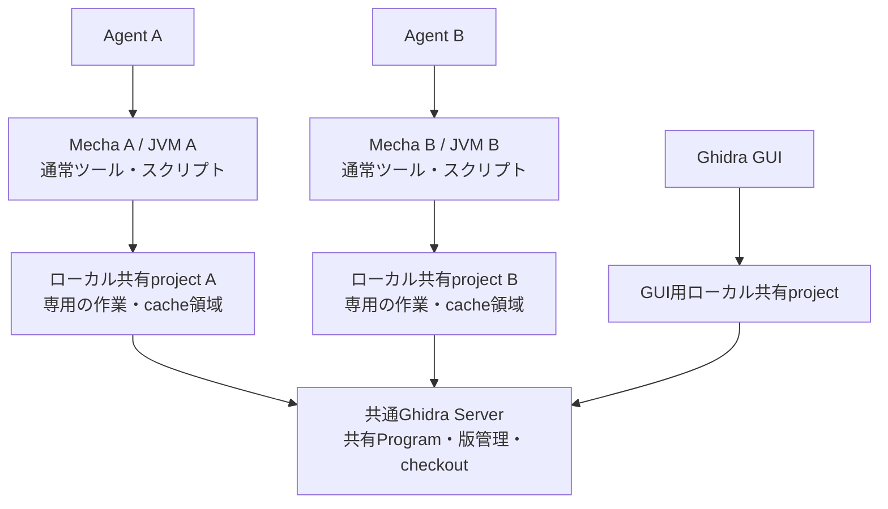

# Ghidra Serverを共有するMecha Ghidraの並列実行設計

2026-09-21作成、2026-09-22改訂。基準コミット: `ef73f5f`（`release/v1.0.0`）。Claude Code / Fable 5.1への3回の相談と現行コード・公式資料の確認を反映した**設計書**。実装、サービスの起動・設定変更、並列動作の実機検証は行っていない。[相談内容と採否](project-worker-fable-consultation.ja.md)。

## 1. 推奨する構成

**現時点では、エージェントの作業単位で既存Mecha Ghidraを別プロセスとして起動し、共通のGhidra Serverへ接続する構成を推奨する。** 独自の常駐ワーカー基盤は実装しない。

対象は「複数エージェントが別々の検体を解析し、途中でスクリプトも実行する」用途。利用者は別ローカルproject間の並列化でよいと確認済みで、接続先を1つにするかも含めて設計判断を求めている。1つのMecha受付を必須条件にせず、既存の共有project運用を使う方を第一案にする。

理由は、スクリプトのPython/JVM内の状態をプロセス間で分離しつつ、既存の保存、checkout、エラー処理、80ツールの契約をそのまま使えるため。新しいIPC、worker管理、状態cache、復旧ツールをリリース前に導入する必要がない。複数JVMのメモリ消費までなくなるわけではなく、ここで減らすのは製品コードの変更量と保守範囲である。



Mecha AのスクリプトはMecha Bの`SCRIPT_BARRIER`を取得しない。同じMecha内のスクリプトと通常操作の排他は既存どおり維持する。1プロセス内に複数targetを置くこともできるが、同時に進めたい作業はプロセスを分ける。毎回のツール呼び出しでJVMを起動し直す構成にはしない。

## 2. Ghidra Serverに任せられる範囲

| 機能・状態 | 担当 |
| --- | --- |
| 共有Programの保存先、版履歴、repositoryへのアクセス権 | Ghidra Server |
| 共有ファイルのcheckout排他、checkinによる版の登録 | Ghidra Server |
| 同期操作の実行、マージ判断、競合時の編集の扱い | クライアント側。Mechaでは既存の同期処理と利用者の判断。Serverが自動マージするわけではない |
| Programを開く、自動解析、デコンパイル | 各MechaのGhidraクライアント/JVM |
| Java / PyGhidra / Jythonスクリプト | 各MechaのPython/JVM |
| 未保存編集、undo/redo、読み込み状態、decompiler cache | 各Mecha |
| MCP受付、target名、`result_id`、結果cache | 各Mecha |
| BSimの検索・DB保存 | 別のBSim機能。Ghidra ServerがBSim DBを兼ねるわけではない |

標準Ghidra Serverは共有repositoryの機能を提供する。各クライアントがローカルのprojectで作業し、変更を共通repositoryへcheckinする構成である。[Ghidra公式説明](https://github.com/NationalSecurityAgency/ghidra/blob/master/GhidraDocs/GettingStarted.md#ghidra-server)

`analyzeHeadless ghidra://...`ではローカル共有projectの明示作成を省けるが、解析・スクリプトは起動したHeadless Analyzerで実行する。repository URLを指定できることは、Serverへ計算を委任できることを意味しない。[Headless Analyzer公式説明](https://github.com/NationalSecurityAgency/ghidra/blob/master/Ghidra/RuntimeScripts/support/analyzeHeadlessREADME.md)

現行Mechaも、[project_handle.py](../src/ghidra_headless/session/project_handle.py)でrepositoryへ接続した後、MechaのJVMで`DomainFile.getDomainObject`によりProgramを開く。[target_lifecycle.py](../src/ghidra_mcp/infrastructure/ghidra_adapter/runtime/target_lifecycle.py)の自動解析と[execution.py](../src/ghidra_headless/scripts/execution.py)のscript実行もそのJVMで行う。

加えてGhidra 12.1.3同梱の`GhidraServer-src.zip`にある`RepositoryHandleImpl`・`RepositoryServerHandleImpl`を静的確認した。公開する処理はrepository、DBファイル、版、checkout、ユーザー等の操作であり、ここに解析・スクリプト実行を送る経路はない。今回Serverを実際に起動・接続して検証したという意味ではない。

「全部をサーバー側に置く」という運用上の希望なら、Ghidra Serverと複数Mechaを同じ解析用ホストに配置できる。その場合も共有データの管理はGhidra Server、計算は各Mechaである。標準Serverそのものへ独自の実行機能を組み込む必要はない。

## 3. 1接続先と複数接続先の比較

| 項目 | 複数の既存Mecha（推奨） | 1受付＋project別worker（将来案） |
| --- | --- | --- |
| 別作業のスクリプト並行実行 | プロセス間で可能 | worker間で可能 |
| エージェントの設定 | 専用の起動設定またはHTTP接続先を割り当てる | 共通の接続先とtargetを使う |
| target・結果cache | インスタンスごと | 親で統合する設計が必要 |
| JVM/未保存状態の所有者 | 既存Mechaがそのまま所有 | workerへ移し、親と状態を同期 |
| 障害復旧 | 影響したMechaだけ終了・再起動 | 親の監視・世代管理・復旧APIが必要 |
| 新規コード・検証範囲 | 配置と設定分離が中心 | 実行基盤と公開エラーを広く変更 |
| メモリ | 解析プロセス数に応じた複数JVM | 同様。親や補助プロセスも考慮 |
| 現時点の判断 | 今回の用途では費用対効果が高い | 接続先統合が必要になってから検討 |

複数エージェントが異なる検体を担当するなら、作業ごとのプロセスに状態がまとまることは運用上も自然である。一方、同じクライアントが大量のprojectを動的に切り替え、単一のtarget一覧と結果cacheを横断的に使いたい場合は、1接続先の価値が高まる。

ローカルMCPクライアントがstdioサーバーを個別起動できるなら、**1作業に1つの常駐stdioプロセス**を基本とする。独立した作業を別々のクライアントセッション、または`mecha-a` / `mecha-b`のような別のMCPサーバー定義に割り当て、各定義に専用の作業パスを固定することを前提条件とする。セッションが別でもサーバープロセスを共用するクライアントでは、別インスタンスを明示的に用意する。親のMCPプロセスを共有するsubagentはこの分離条件を満たさず、agent数だけを増やしても並列化にはならない。実際に別PIDのMecha/JVMが起動することを配置時に確認する。複数HTTPポートの管理を必須にしない。

解析用ホストへ集約してリモート接続する場合は、作業ごとのMechaをHTTPで起動する。必要に応じて既存のプロセス管理やコンテナを利用し、異なるportまたは固定されたURL経路を割り当てる。共通のhostnameの下へ置くことと、状態を理解する単一MCP受付を実装することは別である。

## 4. 作業と保存領域の割り当て

| 項目 | Agent A | Agent B |
| --- | --- | --- |
| Mechaプロセス | A専用 | B専用 |
| ローカル共有project | `/work/agent-a/shared.gpr` | `/work/agent-b/shared.gpr` |
| 接続するGhidra repository | 共通repository | 共通repository |
| BSim一致先用cache | `/work/agent-a/bsim-cache` | `/work/agent-b/bsim-cache` |
| MCP target名 | 例: `default` | 同じ`default`を使ってよい。ログで識別しやすくするなら作業名を含める |
| 結果cache・`result_id` | Mecha A内 | Mecha B内 |
| 認証 | Aの設定 | Bの設定。同じアカウントを使う運用も候補 |

同じ`.gpr/.rep`を複数MechaやGUIで開かない。共有するのはrepositoryであり、ローカルの書き込み可能な作業領域ではない。これは既存の[共有project運用](shared-projects.ja.md)と同じ構成である。

`--bsim-remote-cache-dir`は特に分ける。BSim一致先のcache projectは接続先host・port・repositoryから決まり、同じcache rootを使うと複数Mechaが同じローカルprojectへ収束する。各プロセスのrootを分ければ、この衝突を避けられる。

Ghidra本体・導入済みextension・読み取り用script rootは共有できる候補とし、Ghidra設定、OSGi/コンパイルcache、一時領域、ログは作業ごとに分離する。既存CLIには任意のJVM設定を渡す専用引数がないため、**同じOSユーザーでの起動だけで全書き込み先が自動分離されるとは主張しない**。同一ホストでの設定分離方法を成立性確認の対象とし、必要なら既存コンテナを作業ごとに分け、書き込みvolumeも専用にする。Ghidra本体のインストール変更やextension導入を実行中に行わない。

以下は既存オプションだけによるstdio起動設定の例。指定先の共有projectとServerアカウントは事前に準備する。今回このコマンドを実行したわけではない。

```sh
uv run mecha_ghidra \
  --project-location /work/agent-a/shared.gpr \
  --bsim-remote-cache-dir /work/agent-a/bsim-cache \
  --transport stdio \
  --add-category scripts \
  --add-category shared_sync \
  --shared-sync-exclusive-checkout \
  --ghidra-server-user mecha-ghidra \
  --ghidra-server-password-env GHIDRA_SERVER_PASSWORD
```

Agent Bの起動定義には`/work/agent-b/shared.gpr`と`/work/agent-b/bsim-cache`を固定し、専用プロセスを使う。BSimのツールも必要なら既存のcategoryとDB設定を追加する。パス制限、HTTP認証・公開範囲等の既存設定は[configuration](configuration.ja.md)に従う。

## 5. 解析結果の共有と競合

作業は「自分のMechaでload・編集・スクリプト実行 → local save → repositoryへcommit → 他のMechaがpull/reload」の流れを維持する。ローカルsaveだけでは他のクライアントへ公開されない。未保存編集やundo履歴、スクリプトのPython変数、`result_id`をGhidra Server経由で共有する設計にはしない。

別の検体を扱うことを基本とし、同じ共有Programを複数agentが編集する場合はcheckout規則を使う。exclusive checkoutを設定しても、別Programの解析まで一括排他されるわけではない。一方、同じProgramへの更新競合は、プロセスを分けても自動的には解消しない。

同じServerユーザーで複数ローカルcacheから操作する場合のcheckout識別、checkin、再接続を実機で確認する。機械的に全agentへ別アカウントを要求せず、既存の権限・監査要件に合わせる。競合時の自動マージやローカルproject間の差分転送は追加しない。

## 6. BSimの扱い

Ghidra ServerのrepositoryとBSim DBは別の共有先である。BSimを使わない場合、DBの追加構成は不要。

- H2ファイルDBは1つのMechaプロセス専用にする。複数Mechaで同じH2ファイルを共有しない。
- BSim DBを複数Mechaから共用する必要がある場合は、対応する外部DBを使う。接続が並行可能でも、複数ツールにまたがるmetadata更新まで原子的になるとは扱わない。
- category定義の変更、同じexecutableのmetadata更新や削除は、運用上の管理窓口を揃えるか対象ごとに順序を付ける。別プロセス間のPythonロックは存在せず、Ghidra ServerもそのDB操作を調停しない。新しいDB調停サーバーは作らない。

H2は同じDBファイルへ複数プロセスから同時アクセスできない。[Ghidra公式BSim説明](https://github.com/NationalSecurityAgency/ghidra/blob/master/GhidraDocs/GhidraClass/BSim/BSimTutorial_BSim_Command_Line.md)

前案の「操作ごとにH2 poolを公開APIで破棄して別JVMへ渡す」方法は、未検証の最適化候補として扱い、今回の推奨構成から外す。引き渡し処理、そのためのDB所有者・隔離状態、専有DB workerは実装対象にしない。H2のために解析projectの未保存変更を破棄させる復旧経路も不要になる。

## 7. 障害・停止・結果不明

Aで問題が起きた場合にBを止めないことが分離の目的。Aの終了・再起動は、MCPクライアントまたは既存の運用用プロセス管理から行う。新しい`reset_project_sessions`ツールやMecha独自のsupervisorは導入しない。

ただし、プロセス管理を外へ任せても次の意味は変わらない。

- 通常終了では既存の保存・close処理を通す。killで未保存編集やundo履歴が残るとは保証しない。
- 再起動時に不明な編集・スクリプト・共有commitを自動再送しない。通信切断を「未実行」と決めつけない。
- 接続が失われた共有commitは、再接続後のsync statusやversion historyで反映を確認する。
- Server側のcheckoutとローカルprojectのロックは別であり、Mecha終了やローカルロック解放だけでexclusive checkoutも解除されたとは扱わない。異常終了後もローカルprojectを保全し、同じprojectで再接続してcheckout状態と保存済み変更を確認する。継続不能なcheckoutを解除する必要がある場合は、対象のcheckout IDと変更の扱いを確認してから、権限を持つ利用者が既存の`terminate_project_program_checkout`等の管理操作を行う。自動解除や、別の空projectへの置き換えで復旧したとみなす処理は追加しない。
- タイムアウトはスクリプトの協調停止であり、監視を無視する任意のスクリプトを必ず止めるものではない。現行コードにMCP cancelから実行中monitorへつなぐ経路があるとは主張しない。
- OSやコンテナの再起動機能を使う場合も、decompiler等の子プロセス回収、projectロック解放、再起動後の復旧状態を確認する。プロセス管理ツールを選んだだけでこの検証が不要になるわけではない。

復旧と結果不明の扱いは運用手順に記載する。保存・再起動を自動化する新しい方針は今回追加しない。

## 8. 1接続先が必要になった場合の将来案

単一接続先が必要になる具体的な条件は、(a)利用クライアントが作業別の接続を扱えない、(b)動的な多数projectを1つのtarget名前空間と結果cacheで操作したい、(c)作業別の接続設定の運用負荷が実測で大きい、のいずれか。単に同じGhidra Serverを使うことは条件にしない。

Fableは既存MechaのMCP endpointへ転送するルーターも提案した。この方式は独自IPCの再実装を減らせるが、「target→接続先」「result_id→接続先」の2表だけで全ツールを維持できるとは判断しない。

| ルーターで追加設計が必要な操作 | 理由 |
| --- | --- |
| `create_project`、`open_program`、`register_target` | targetがない/未登録でもprojectの所有者を選ぶ必要がある |
| `bsim_load_matched_executable` | 一致先から別project・targetが作られ得る |
| `list_targets`、script catalog、tools/resources | 子ごとの一覧や設定差をどう見せるか決める必要がある |
| `read_result`、`search_result`、結果resource URI | 検索cursorやresource経由の取得まで元の子へ固定する必要がある |
| 子Mechaの再起動 | 同じ接続先でも旧target・resultが有効とは限らない |

MCPのHTTPセッションがstatelessでもGhidra状態はプロセス内にある。汎用load balancerによるランダム振り分けは採用しない。1つのURLの下に作業別経路を置く固定ルーティングは、単一の統合MCPサーバーとは区別する。

単一接続先を再検討する場合は、既存MCPを使う固定所有者のルーターと、親＋project workerの内部IPC方式を比較する。次の設計上の修正は引き継ぐが、現時点では実装しない。

1. 現行`open_program`はロード済みsessionの置き換えを拒否する。旧・新projectのProgramを同時保持して切り替える機能は追加せず、明示close後のopenを維持する。
2. 同期serviceは再利用するが、生成callable・例外wrapperを含めた非同期境界を明確にする。`CallToolResult`の正規化・schema検証・presentationを二重実行しない。
3. 親の状態表示は観測snapshotとし、上書き可否は親の登録とworkerの開いたhandleの両方で判断する。worker内の既存guardを残す。
4. script一覧のためだけの補助JVMは起動しない。catalogは親、実行環境の確認は実行workerで行う。
5. 内部IPCを作る場合でも、同一ホストの大きい結果はspoolファイルで渡し、独自のchunk再組立を増やさない。実行終了と結果取得成功は別に通知する。
6. 起動上限に達して退避可能なworkerがなければ実行前に拒否し、未保存Programを自動で追い出さない。起動時load、待機期限、cancel後の所有権を明示する。
7. H2の引き渡しやDBの解放失敗からproject全体への隔離は基本要件にしない。DBだけの障害で正常なProgramの保存を禁止しない。
8. worker内の既存ロックやタイムアウトを「直列だから到達不能」と一括撤去しない。background処理・cleanupとの関係を確認してから簡素化する。

## 9. 次に行う成立性確認

以下は将来の検証計画であり、今回実行していない。使い捨てrepositoryと別々のローカル共有projectを用意して実施する。

| 項目 | 確認内容 |
| --- | --- |
| 接続の分離 | 実際のagent実行環境で、専用stdioまたは固定HTTP接続先が使われ、別々のMecha/JVMになる |
| 通常解析とscript | Aのscriptを同期用イベントで待たせている間に、Bのデコンパイル・編集・scriptが完了する |
| ランタイム | Java / PyGhidra / Jythonと既存の子script経路で、出力・module・providerの状態が混線しない |
| 書き込み領域 | project、BSim remote-cache、Ghidra設定、OSGi/cache、一時領域、ログの衝突がない |
| 共有と競合 | A/Bの異なるProgramへのcheckout・commitが可能。同じProgramのexclusive checkoutを迂回しない |
| 共有の可視性 | Aのlocal saveだけでは共有完了と扱わず、commit後にBがpull/reloadして変更を取得する |
| BSim | 専用H2と共有外部DBを別に確認。同じexecutableの管理操作は運用上の順序を維持する |
| 障害分離 | Aの停止・異常終了時もBが継続。Aの子プロセスとprojectロックが適切に回収される |
| checkout復旧 | Aの異常終了後、ローカルロックとServerのcheckoutを別々に確認。同じlocal projectでの再接続・継続、必要時の明示的なcheckout解除を確認する |
| 応答不明 | 編集・commit中の切断を未実行扱いせず、再送せずに状態を確認できる |
| 状態の所属 | `result_id`やcursorを取得元のMechaで使う。再起動後の古い参照を成功扱いしない |
| 配布形態 | 実際に採用するstdio/HTTP、OS、Docker構成で検証する。別構成の成功を流用しない |
| 資源 | 1・2・4 Mechaのcold/warm起動、総RSS、CPU、要求待機時間を測り、上限を決める |

まず2プロセスの構成で成立性と運用負荷を確認する。問題が接続・保存領域の設定だけなら設定と文書の改善で対応し、不足する起動設定が見つかった場合のみ限定した実装案を別途作る。1接続先を必要とする具体的な事情が残った場合に、§8の設計へ進む。

## 10. 今回の確認範囲

- Claude Codeで`--model fable`を指定し、実際のモデルが`claude-fable-5-1`であることを実行記録で確認した。
- 最初は設計書だけ、ソース読み取りの明示許可後はRead / Glob / Grepだけで関連コードを確認させた。編集・shell・MCP・テスト実行は許可していない。
- 受け取った指摘をローカルの現行コード、Ghidra公式文書、Ghidra 12.1.3同梱Serverソースと照合し、採否を[相談記録](project-worker-fable-consultation.ja.md)に残す。
- 独自worker方式を実装するという前提を外し、既存Mechaを作業単位で分ける構成を推奨に変更した。既存80ツールの実装・公開契約は変更していない。
