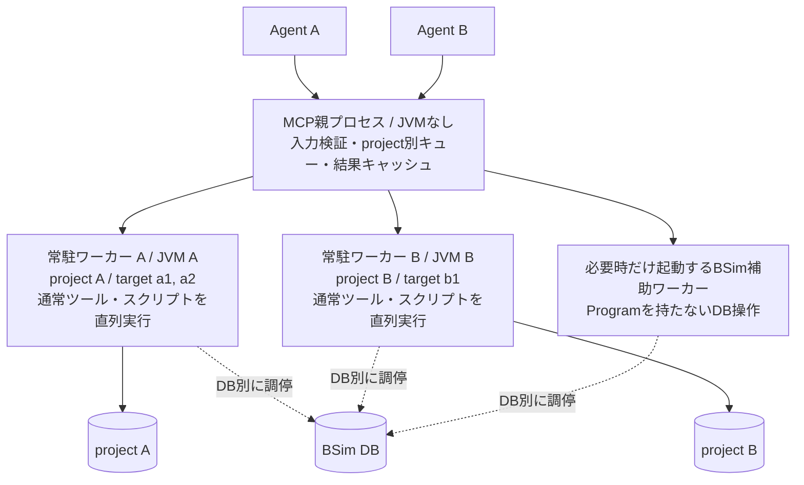

> 初回・ソース確認時のレビュー対象だった旧案です。現在の推奨は[改訂設計](../../project-worker-parallelism-design.ja.md)を参照。保存場所に合わせて相対リンクだけ変更しています。

# project単位の常駐ワーカーによる並列実行設計

2026-09-21。基準コミット: `ef73f5f`（`release/v1.0.0`）。**設計案。ワーカー方式、新しい設定、復旧ツールは未実装。**

## 1. 採用する構成

**1つのローカルGhidra projectを1つの常駐Python/JVMプロセスが所有する。** MCPの親プロセスは要求をproject別に振り分ける。別projectでは通常の解析、編集、スクリプトを並行実行し、同じprojectに対する操作は順番に実行する。

ユーザー確認済みの対象は「別project間の並列化」。同じproject内の別検体を並列化するための作業コピー、差分転送、マージは含めない。スクリプトだけを別プロセスへ送る方式にもせず、そのprojectのProgram、未保存変更、undo履歴を同じワーカーで保持する。



| 同時に要求された操作 | この設計での動作 |
| --- | --- |
| project Aのスクリプト + project Bのデコンパイル | 並行実行 |
| project Aのスクリプト + project Bのスクリプト | ランタイムの組み合わせにかかわらず並行実行 |
| project Aのtarget a1 + 同じprojectのtarget a2 | 同じキューで直列実行 |
| 同じtargetへの編集・読み取り | 要求を受理した順に直列実行 |
| スクリプト実行中の`read_result`、`list_targets` | 親プロセスで応答 |
| 別projectから同じBSim DBを使用 | 初版はそのDBへの組み込みBSim操作だけ直列化 |
| 別ローカルprojectから同じ共有リポジトリを使用 | ローカル実行は並行。共有ファイルのcheckout・競合規則は維持 |

これはCPU・メモリ・ディスクまで独占できるという保証ではない。また、共有のtarget名前空間とOS権限は現行のままであり、ユーザーごとの認可やスクリプトのセキュリティサンドボックスは別の要件となる。

## 2. 現状と変更理由

現行の通常操作はproject/targetのロックを取り、スクリプトはプロセス共通の`SCRIPT_BARRIER`を排他取得する。通常操作同士は別projectなら並行可能だが、スクリプト実行中は同じサーバープロセスの通常操作も待つ。

根拠は[locks.py](../../../src/ghidra_mcp/application/locks.py)、[core_execution.py](../../../src/ghidra_mcp/infrastructure/ghidra_adapter/runtime/core_execution.py)、[script_execution.py](../../../src/ghidra_mcp/infrastructure/ghidra_adapter/runtime/script_execution.py)。スクリプト側にはPythonのプロセス内状態、共有Jython interpreter、Javaの静的状態、providerや生成スレッドの管理がある。[execution.py](../../../src/ghidra_headless/scripts/execution.py)の排他だけを外しても分離できない。

ワーカー方式ではこの状態をprojectごとに分ける。既存の`SCRIPT_BARRIER`とローカルなロックは最初は各ワーカー内に残す。プロセスを分ければ他projectを止めなくなるので、並列化と同時に既存の排他処理まで書き直す必要はない。

JPypeは初期化済みJVMを`fork`で複製する用途をサポートしていない。そのため、新しいPythonプロセス内でそれぞれJVMを起動する。Javaオブジェクトをプロセス間で受け渡さない。[JPype公式文書](https://jpype.readthedocs.io/en/stable/userguide.html#multiprocessing)

## 3. 所有する状態と内部境界

| 親プロセス | projectワーカー |
| --- | --- |
| MCP SDK 2.2.0、stdio / Streamable HTTP | PyGhidra、JVM、Ghidra API |
| 公開スキーマ、入力検証、出力整形 | 同期のapplication serviceと既存handler |
| target → project → workerの登録表 | そのprojectだけの`RuntimeState` |
| キュー、起動数、プロセスの監視 | ProjectHandle、Program、consumer、transaction |
| 最後に受信した状態の表示 | dirty状態、共有同期の保留、隔離状態の実体 |
| スクリプト一覧と起動時の原本snapshot | 実行用snapshot、inline source、provider、interpreter |
| `ResultResourceStore`、`read_result`、`search_result` | decompiler、undo/redo、revision、cursorの検証 |
| BSim一致先の選択とtarget割り当て | 署名生成・検索・一致結果の適用、保存・checkout |

親はJavaオブジェクトを保持せず、BSimのバージョン照会やスクリプト利用可否のためにもJVMを起動しない。JVM初期化を伴うimportや起動処理を親から除くことをテストする。

同期の[各service port](../../../src/ghidra_mcp/application/services/ports.py)はワーカー内で再利用する。全serviceを非同期へ書き換えず、親に`WorkerClient`と非同期の振り分け処理を追加する。内部操作を`core`、`target`、`sync`、`script`、`bsim_db`などの明示的な型へ変換し、ワーカー側の固定dispatch表へ渡す。Pythonの関数、closure、Java参照、任意の属性名をRPCとして渡さない。

親のToolBindingは非同期関数とし、既存の入力変換、ToolSpec、出力整形を共用する。現在の[call_tool](../../../src/ghidra_mcp/presentation/mcp_server.py)は非同期bindingにも対応している。ワーカーへMCPサーバーをもう1つ立てる必要はない。

## 4. projectの同一性とtarget管理

### 同じprojectを二重に開かない

`ProjectKey = (canonical_project_directory, project_name)`とする。[ProjectHandleの正規化](../../../src/ghidra_headless/session/project_handle.py)をJava非依存の共通関数へ切り出し、親とワーカーの両方で使う。既存の`.gpr`指定、ディレクトリ＋project名、作成時と既存projectを開くときの違いを維持する。

相対パス、`~`、symlinkを解決した後に所有者を決める。大文字小文字を区別しないファイルシステム上の別表記も同じ所有者に収束させる。既存projectではファイルの同一性を補助確認し、新規作成中は正規化した親ディレクトリと名前で予約する。内容のハッシュ計算は使わない。

同じキーへの初回要求が重なったら1回だけ起動し、残りは同じ起動結果を待つ。短い登録表ロックの中で`STARTING`を予約してから起動する。起動、IPC、Java処理を待つ間は登録表全体をロックしない。Ghidra自体のprojectロックも維持し、競合時にlockファイルを削除しない。

### 登録・open・close

- `register_target`は原則として親にメタデータを登録する。登録だけで全projectのJVMを起動しない。稼働中targetの別projectへの再登録を拒否する現行ルールを維持する。
- `create_project(overwrite=true)`は、親に登録だけされているtargetも含めて利用中かを判定する。worker内のロード済みProgramだけを見て上書きを許可しない。親のproject予約中に判定し、worker側の既存guardとGhidraのロックも維持する。
- `open_program`、`load_project_program`、import等で初めて必要になったワーカーを起動する。起動済みならJVM・project・decompilerを再利用する。
- 同じprojectに属するすべてのtargetを同じワーカーへ渡す。`default`を含めtarget名の意味は変えない。
- `close_session`の通常経路は保存して閉じ、`discard_changes=true`だけが未保存変更を破棄する。targetの登録は残す。削除を伴うツールは成功した削除を確認してから登録表へ反映する。
- workerからの完了応答にtarget状態の差分を付け、親の表示を更新する。実行中は最後に観測した状態であることを示し、親の古いdirtyフラグを保存・破棄判断の根拠にしない。

`open_program`で既存targetを別projectへ切り替える場合は専用の複合操作とする。親が旧・新projectの操作枠を一定順序で予約し、新projectで仮セッションを作成・検証し、旧セッションの正常close後に新しい経路を公開する。失敗時は仮セッションを回収し、旧経路または明示的な隔離状態を保持する。片方のワーカーがもう片方へRPCする構造にはしない。

## 5. 待ち行列と並行性

各projectのGhidra操作枠は1つ。親にproject別FIFOキューを置き、実行枠が空いた要求だけを送る。`batch_read`も1つの要求として扱い、項目の間へ別の編集を挟まない。cancel、状態確認、強制復旧の制御メッセージは実行キューと分ける。

**待機に共通のAnyIOスレッドプールを使わない。** 忙しいproject Aへの要求だけで全スレッドを占有すると、project Bを分離してもBが実行できなくなる。キュー待ちとIPC受信は非同期I/Oとし、同期のGhidra処理はワーカーの実行スレッドで行う。親で必要なファイルI/O等は短い処理として別に扱う。

通常要求の待機予算には既存の`--lock-timeout-seconds`、スクリプトには`--script-queue-timeout-seconds`を引き継ぐ。起動待ち、キュー待ち、実行時間を別々に記録し、ロック待機のたびに同じ予算を最初から与え直さない。開始後のスクリプト制限には既存の`timeout_seconds`を使う。

未起動projectの初回要求では、まず独立した起動期限を適用し、readyになった後の操作待機にキュー期限を適用する。したがって初回の壁時計時間は通常のロック待機上限だけでは決まらない。初期化が成功しても、待機中にcancelされた要求を実行しない。

待機数は初期案としてprojectごと32、サーバー全体256で制限する。超過時は実行前にbusyを返す。この数は測定前の暫定値であり、CPU数から並列度を自動増加させない。キュー内のcancel・期限切れは取り除き、後で実行されないようにする。

同じBSim DBなど追加資源が必要な要求では、project枠とDB枠の両方が空いた時点で開始する。DBを保持したまま別projectの終了を待つなど、資源の取り合いが循環する順序を作らない。通常の解析にはDB枠を要求しない。

## 6. プロセス起動とIPC

新しいPythonプロセスを`sys.executable -m ghidra_mcp.infrastructure.worker.entrypoint`で起動する案とする。これは追加予定の内部entrypointであり、現在は存在しない。shellを経由せず、初期化済みJVMを引き継がない。

最初の実装は親が作るワーカーごとのloopback socketを用い、起動時に一度だけ認証する。接続先とランダムな起動用tokenはstdinのbootstrapデータで渡し、コマンドラインやログに認証情報を載せない。接続と認証完了後は待受socketを閉じる。独立したHTTPサービス、外向けport、サービス探索は追加しない。

workerのstdout/stderrはログ用に回収し、親のMCP stdoutへ流さない。Javaの`System.out`やスクリプトによる直接出力がRPCを壊さないよう、通信チャネルを分ける。ログは常時読み出し、量が多いときは上限付きで省略する。ログを読まないために子プロセスがpipeで停止する状態を作らない。

| 要素 | 内容 |
| --- | --- |
| handshake | プロトコル版、worker世代、projectキー、ソフトウェア版、runtime利用可否 |
| request | request ID、worker世代、targetの割り当て世代、操作種別、JSON引数 |
| control | 対象request IDを指定したcancel、shutdown。Ghidra操作の割り込み実行はしない |
| response | 完了・失敗の区別、既存の結果または構造化エラー、target状態差分 |
| lifecycle | 要求の受理・実行開始・終了。プロセス終了は親もOS経由で検知 |

UTF-8のJSONを長さ付きframeで送る。大きな結果は分割して親の一時領域へ順次書き出し、完了確認後に既存の結果処理へ渡す。frame単位の上限とbackpressureを設け、出力サイズが大きいだけで新たにツール結果を切り捨てない。総保存量は既存の結果キャッシュ方針とディスク予算に従う。未完了の結果は成功した`result_id`として公開しない。

大きなJSONの復号・schema検証・結果圧縮で親のevent loopを占有しないよう、結果処理にも上限付きの実行枠を用意する。この処理の枠をprojectのキュー待機と共用せず、1つの巨大応答が他projectのIPC受信や制御処理を止めないことを確認する。

処理完了の通知と結果転送完了は区別する。編集完了後に結果の転送・保存・整形だけが失敗した場合、実行済みと表示する。現在のpresentation failureと同じく、再実行可能な編集失敗に変換しない。

通信切断後の自動再送は行わない。request IDは応答を対応させるために使い、永続的なexactly-once保証は導入しない。古いworker世代からの遅れた応答は新しいtarget状態へ反映しない。

## 7. スクリプト実行

親の起動時catalogは一覧・メタデータと原本snapshotを持ち、各ワーカーはそこから同じ内容の実行用コピーを作る。Javaのコンパイル済みbundleや実行中のstagingを複数ワーカーで共有しない。`script_id`、catalog revision、runtime指定、引数、出力制限は現行契約を維持する。SHA-256検査は追加しない。

inline sourceは文字列としてワーカーへ渡し、stagingの作成と削除をワーカーで行う。親が要求の待機を打ち切っただけで実行中のファイルを消してしまう構造を避ける。worker終了後に残った一時領域だけを親が回収する。

ワーカーごとにGhidraの設定領域、Java user.home、OSGi・コンパイルcache、一時領域を分ける。OSの`HOME`全体を無条件に置き換えるのではなく、既存の認証・スクリプトの参照先を保ち、Ghidraが書き込む領域を公開された設定方法で分離する。Ghidra本体と導入済みextensionは共通の読み取り元とし、Jythonの検出が全ワーカーで一致することを確認する。

PyGhidraの例外伝播probe、provider初期化、ランタイム利用可否の確認は各ワーカーの起動時に行う。`list_scripts`等が起動待ちのワーカーへ同期問い合わせしないよう、同一設定の補助ワーカーで初回の利用可否を確定し、projectワーカーのhandshakeで再確認する。実行ワーカーで利用不可なら実行時に明確なruntimeエラーを返す。補助ワーカーはBSimと共用できるが、ユーザースクリプトを実行しない。

スクリプト実行、transaction、失敗時rollback、dirty/共有同期保留の更新、decompiler再初期化、スレッド終了確認をprojectワーカー内に残す。任意のスクリプトによる外部ファイル・ネットワーク・別projectへのアクセスまでは、この仕組みで制限しない。信頼できるスクリプトをサーバーのOS権限で実行する現在の前提を維持する。

## 8. BSimと共有リポジトリ

### BSimの振り分け

Programを必要とする`bsim_query`、`bsim_register_target`、`bsim_update_target_signatures`、`bsim_apply_matches`はprojectワーカーで実行する。DBのstatus、一覧、category、metadata変更、削除はProgramを持たない補助ワーカーで行う。補助ワーカーは必要時に1つ起動し、親にJVMを戻さない。

`bsim_load_matched_executable`は親が一致先とtargetの重複を解決し、そのprojectのワーカーへopenと検証をまとめて依頼する。[BsimService](../../../src/ghidra_mcp/application/services/bsim_service.py)が現在渡している`validate=lambda: ...`は、型付きの一致先検証データへ変更する。MD5、domain path、function address等の検証が終わる前にtargetを公開しない。BSimの識別子としての既存MD5は、撤去したスクリプトSHA-256検査とは別であり維持する。

一致先の索引はclose、reload、worker障害で無効化し、親の古い索引だけで読み込み済みと判断しない。同じrepository用のローカルcache projectに入る一致先は同じワーカーに集約する。裏でcacheを分割して並列度を増やさない。

### DB単位の調停とH2

初版では、組み込みBSimツールの操作全体にDBキー単位の非同期排他を設ける。異なるDBは並行可能とする。これにより、同じDB内のmetadataの読み取り・更新が別ワーカーで割り込まれることも防ぐ。リモートDBの読み取り並列化は、必要性を測定してから独立した変更として行う。

H2は同じDBファイルを複数プロセスで同時に開けない。[Ghidra公式BSim説明](https://github.com/NationalSecurityAgency/ghidra/blob/master/GhidraDocs/GhidraClass/BSim/BSimTutorial_BSim_Command_Line.md)

さらにGhidra 12.1.3同梱の`BSim-src.zip`を静的確認したところ、通常のdatabase `close()`だけでは接続プールの廃棄まで保証されない。`BSimH2FileDBConnectionManager`はstatic mapにdata sourceを保持している。したがって、H2の各操作の終了時には以下の順序を採用する。

1. `SimilarFunctionQueryService`、署名生成器、databaseなど、操作が使用した資源を既存の公開APIでclose/disposeする。
2. `BSimH2FileDBConnectionManager.getDataSourceIfExists(BSimServerInfo)`で既存data sourceを取得する。
3. `getActiveConnections() == 0`を確認して公開`dispose()`を呼ぶ。この経路はvector storeのcacheも除去する。接続が残る場合は他の接続を強制破棄せず、解放失敗としてDB枠を隔離する。
4. 解放確認後に親がDB枠を次のワーカーへ渡す。解放途中のworker停止は、OS上の終了を確認してから次を許可する。

このAPI経路は同梱ソースで確認した設計候補であり、**2つのJVMでA→B→Aと開き、更新内容が見える実機検証は未実施**。非推奨のURL overload、private fieldへのアクセス、reflectionによるpool操作は使わない。公開APIによる解放で成立しない場合はH2の対応完了とはせず、DB操作の専有プロセス化を別途設計する。既存のin-processモードは維持する。

projectワーカーでDBの解放に失敗した場合はそのprojectとDBを隔離し、明示復旧で所有プロセスを終了してから再利用する。補助ワーカーは未保存Programを持たないため、解放失敗時に終了確認を経て置き換えられる。ただし、その時点のDB要求を成功扱いしたり、自動再実行したりはしない。

DBキーは認証情報を除いた実際の接続先から作り、file URLは実パスへ正規化する。ログでは既存のURL maskingを使う。別のMecha Ghidraサーバーや任意のスクリプトが同じDBへ直接アクセスする場合まで、この親プロセスの調停で保護できるとは説明しない。

### 共有Ghidra repository

checkout、save、checkin、pull、競合時の中止、ローカル変更と共有反映待ちの区別を既存handlerに残す。各ワーカーは自分のローカルprojectを開き、共有サーバー側の競合処理を迂回しない。別projectに分離されても、同じ共有Programへの同時更新が常に成功するわけではない。

共有commitの応答が失われた場合は「成功したか不明」とし、自動checkinを繰り返さない。version history / sync statusで確認する。ローカルprojectの保存とBSim DB更新を分散transactionとして一括rollbackできるとは扱わない。

## 9. キャンセル・障害・復旧

### 自動killを既定にしない

実行前のcancelはキューから除去する。開始後はGhidra monitor等へ協調的に停止を要求し、現在のスクリプトtransactionを終了できたか確認する。MCPクライアントの切断だけでprojectワーカーをkillしない。

スクリプトの`timeout_seconds`経過後も協調停止とcleanupを試みる。停止待ちの猶予を超えた場合はprojectを`unresponsive`にし、新しいGhidra要求を拒否して親は応答を返す。初期猶予案は10秒とし、phase別の実測で調整する。要求が終了したか確認できなければ、その後も処理や外部への書き込みが継続し得ることをエラーに含める。実行枠を解放して次の要求を重ねない。

起動には独立した期限を設定する。既存のdecompileやbatchの期限も維持するが、すべての通常操作に一律の実行期限や自動killを新設しない。制御用チャネルへの応答があるだけで、Ghidra処理が進んでいるとは判断しない。

停止確認ができないスクリプトや残留スレッドによりinterpreter全体の状態が不明になった場合、workerモードでは同じprojectの全targetを隔離する。正常にrollbackできた通常のスクリプト例外までproject全体の障害に格上げしない。

状態遷移は`registered → starting → ready ⇄ busy`を通常経路とし、起動失敗・プロセス終了は`failed`、停止確認不能は`unresponsive`へ移す。`unresponsive`になった後の遅い完了通知は結果の判明として記録するが、それだけで隔離を解除しない。正常なcleanupまで確認して既存のclose経路で閉じるか、project単位の復旧へ進む。

### 障害状態と再実行

| 発生点 | 親の扱い |
| --- | --- |
| 起動失敗、送信前のqueue timeout | 未実行。原因解消後の再要求が可能 |
| 送信後、完了通知前に通信断・worker停止 | 実行結果不明。自動再実行しない |
| 実行完了通知後、結果転送失敗 | 実行済み・結果取得失敗。編集を再実行しない |
| worker停止 | そのprojectの全ロード済みtargetを無効化。未保存変更を失った可能性を通知 |
| 親の結果キャッシュに保存済み | worker停止後も既存の保持期限・容量の範囲で取得可能 |

workerが死んでも、既に実行した保存・共有commit・外部ファイル変更が取り消されたとはみなさない。直前のスクリプト以外の、以前の成功した編集も未保存なら失われる可能性がある。

新しい失敗は既存の構造化エラーへ統合する。追加候補は`WORKER_CAPACITY_EXCEEDED`、`PROJECT_WORKER_UNAVAILABLE`、`EXECUTION_OUTCOME_UNKNOWN`、`PROJECT_RESET_REQUIRED`。detailsに対象project、影響target一覧、実行段階、`not_started / completed / unknown`、未保存状態の不確実性を含める。error enum、mapping、公開output schema、説明、テストを一緒に変更する。

### project単位の明示的な復旧

親が処理する管理ツール`reset_project_sessions`を1つ追加する案とする。既存80ツールの引数変更とは分ける。

```json
{"target": "sample_a", "discard_changes": true}
```

対象targetの属するproject全体が範囲となる。ツールの説明と`list_targets`のproject情報で、そのprojectに属するすべてのtargetが対象であることを確認可能にする。`discard_changes`は必須で、`false`では停止・破棄を行わない。read-only profileへ公開しない。

対象は障害・隔離・応答不能になったprojectとする。健全なprojectの通常終了には既存の`close_session`を使う。親が新規要求を止め、協調終了、必要ならプロセス終了を行い、**旧プロセスの終了を確認してから**セッション状態を破棄する。終了確認ができなければ失敗とし、新ワーカーを起動しない。

復旧結果には全影響target、未保存変更の損失可能性、実行結果不明の要求IDを返す。targetの登録は残し、自動でProgramを再ロードしない。その後の明示的なopen/loadで、保存済みprojectまたはGhidraの復旧状態を確認する。通常の`close_session(discard_changes=true)`によるtarget単位の隔離解除は、ワーカーが健全に応答できる場合に引き続き使用する。

### 親・子の終了

正常終了では受付停止後、各ワーカーを並行してdrainし、保存・closeの結果を集約する。保存やcloseに失敗したtargetを成功扱いにしない。強制終了が必要な場合は対象と保存できなかった状態をログに残し、異常終了を返す。

POSIXでは`start_new_session=True`等でワーカーとdecompiler子プロセスを管理し、WindowsではJob Object等のOS側の子プロセス管理を用意する。Pythonの`preexec_fn`は使わない。[Python公式subprocess文書](https://docs.python.org/3/library/subprocess.html#subprocess.Popen)

親の異常終了時はIPCのEOFで停止する経路を持つ。ただしnative処理が停止した子にPythonのEOF監視だけでは十分でない。POSIXの小さな監視プロセス、Windowsのkill-on-close設定を含むOS別の終了管理を実装・検証し、親の強制終了後に旧所有者が残った状態でprojectを再取得しない。任意のスクリプトが明示的に管理外へ離脱させた子プロセスまで回収する保証は含めない。

## 10. revision、結果と公開契約

既存の`Context.generation`とProgramのmodification numberによるrevisionを維持する。worker再起動後のProgram再ロードは新しいgenerationになるので、古いcursorや`expected_revision`をそのまま受理しない。IPCのworker世代と公開revisionは別の目的であり、公開revisionを新しいハッシュ形式へ置き換えない。

結果キャッシュは親のままにする。障害前の結果はその時点のsnapshotとして取得できるが、現在のProgram状態を表すとは扱わない。親の再起動時には、現行同様に結果キャッシュは失われる。

既存80ツールの名前、通常の入力・結果形式、checkout条件、ToolSpecによるprofile制限を維持する。追加する公開変更は、復旧ツール、新しい実行基盤のエラー、`list_targets`のruntime状態情報とする。後者はモデルに明示的に追加し、実行中の状態が古い観測値であることを表す時刻・状態を含める。既存の必須項目の意味を変えない。

MCP SDKのprivate属性、非推奨API、PyGhidraへの例外伝播monkey patchを追加しない。stdioとHTTPで同じ振り分け処理を使い、MCP SDK 1.x用の互換経路やPyPI公開対応は追加しない。

## 11. 起動設定とメモリ

初期導入は`--execution-mode in-process|workers`で選択可能にし、既定値は現行の`in-process`を保つ。workersモードでのみ以下を追加する案とする。

| 設定 | 意味・初期案 |
| --- | --- |
| `--max-project-workers` | project用プロセス数の上限。初期値2 |
| `--worker-max-heap` | 各JVMの上限。初期値2 GiB案、既存のJVM設定と競合させず起動前に検証 |
| `--worker-startup-timeout-seconds` | JVM初期化・handshakeまで。初期値120秒案 |

補助ワーカーは最大1つで、project用上限とは別枠と明示する。scriptsの公開に必要な初回probe、またはDBのみのBSim操作が必要になった時点で起動する。上限2の場合でも、JVM数は最大3になる。補助ワーカーにも同じheap上限を適用する。これらの値は実測前の開始点であり、推奨動作環境の数値として公表しない。

容量が足りない場合、ロード済みProgramのあるワーカーを勝手に追い出さない。保存済みでもundo履歴やrevisionが失われるためである。Program・orphan・実行中要求のないワーカーだけを終了して枠を空け、別projectへは新しいプロセスを割り当てる。スクリプト実行済みのプロセスを別projectへ使い回さない。

概算メモリは「親 + 各workerのPython/JVM/Program + decompiler子プロセス + 必要なら補助worker」となる。`-Xmx`は総RSS上限ではない。自動解析の内部スレッドも含め、1・2・4 projectのRSS、CPU、待機時間、処理時間、起動時間を測って既定値を決める。

以下は**実装後の設定例**であり、現在のCLIでは使えない。

```sh
mecha_ghidra \
  --execution-mode workers \
  --max-project-workers 2 \
  --session 'name=sample_a,project_location=/work/project_a.gpr,domain_path=/a.bin' \
  --session 'name=sample_b,project_location=/work/project_b.gpr,domain_path=/b.bin'
```

## 12. 実装箇所と進め方

| 対象 | 変更 |
| --- | --- |
| [cli.py](../../../src/ghidra_mcp/presentation/cli.py)、[cli_runtime.py](../../../src/ghidra_mcp/presentation/cli_runtime.py) | in-process/workerの組み立て分離。親のJVM起動をworkerへ移す |
| `infrastructure/worker/`（新規） | 起動、IPC、local service組み立て、OS別の停止管理 |
| `application/services/worker_supervisor.py`等（新規） | 所有者、非同期queue、target経路、状態、復旧 |
| [tool_binding.py](../../../src/ghidra_mcp/presentation/tool_binding.py)、[tool_dispatcher.py](../../../src/ghidra_mcp/presentation/tool_dispatcher.py) | 非同期worker実行経路。既存の検証・出力変換を共用 |
| [ports.py](../../../src/ghidra_mcp/application/services/ports.py)、[target_lifecycle.py](../../../src/ghidra_mcp/infrastructure/ghidra_adapter/runtime/target_lifecycle.py) | open＋型付き検証、project切り替え、状態DTO |
| [script_service.py](../../../src/ghidra_mcp/application/services/script_service.py) | 親catalogとworker内staging・実行の分離 |
| [bsim_service.py](../../../src/ghidra_mcp/application/services/bsim_service.py)、[java_backend.py](../../../src/ghidra_mcp/infrastructure/bsim/java_backend.py) | 一致先の調整、補助worker、DB資源の解放 |
| [read_only_bsim.py](../../../src/ghidra_headless/handlers/commands/read_only_bsim.py)、[mutating_bsim.py](../../../src/ghidra_headless/handlers/commands/mutating_bsim.py) | H2 handoffの共通cleanup経路 |
| contracts・error mapping・tool docs・configuration docs | runtime状態、復旧ツール、追加設定、エラーの契約 |

段階ごとにレビューできる単位へ分ける。

1. **成立性の実機確認**: 一時projectで2 JVM同時起動、設定・Jython分離、H2のA→B→A、worker停止後のproject再取得、OS別の子プロセス回収を確認する。実運用projectは使わない。
2. **1 workerでの同等性**: 純粋なproject identityと内部DTO、ローカル組み立てを切り出し、1 projectをIPC経由で既存どおり操作する。親JVMなし、80ツールの入出力同等性を先に確認する。
3. **複数projectの並列化**: 非同期queue、所有者予約、起動上限、BSim補助worker、DB調停、複数projectへのtarget切り替えを実装する。
4. **障害と復旧**: キャンセル、結果不明の分類、project単位の隔離・明示復旧、終了処理、結果転送失敗を揃える。
5. **公開・性能確認**: 新設定と復旧ツールを公開し、stdio/HTTP・実Ghidra・配布形態ごとの検証後にworkersモードを利用可能にする。既定値の切り替えは別のリリース判断とする。

機能フラグの存在だけを理由に未検証のworkerモードを製品対応済みとは扱わない。必要な並列化はproject分離と状態管理であり、分散ジョブ基盤、Redis、ネットワーク越しworker、毎要求のprojectコピー、自動マージは追加しない。

## 13. 受け入れ条件

| 項目 | 合格条件 |
| --- | --- |
| 並行実行 | Aのスクリプトを同期用イベントで待機させている間に、Bの読み取り・編集・スクリプトが完了する。時間差だけで推測しない |
| ランタイム分離 | Java / PyGhidra / Jythonの3×3組み合わせ、例外、既存の子スクリプト経路を確認。argv、module、出力、provider状態が混線しない |
| 同じproject | 別target・別パス表記・同時初回openでも所有者は1つ。FIFO、close/import/saveの順序を維持 |
| 親の応答性 | 忙しいAへの要求が共通thread poolの既定規模を超えても、Bと`read_result`・catalog・状態照会が進む |
| 通常契約 | 既存80ツールを1 workerで比較し、出力、cursor、revision、dirty、undo/redo、profile制約を維持 |
| 障害分離 | AのJVM停止・応答不能でBが継続。Aの他targetの未保存変更も影響範囲に含める |
| 不明な結果 | 編集、save、shared commitの前後で応答を失わせても自動再実行しない。完了通知済みの転送失敗を区別 |
| キャンセル | 実行前は未実行。実行中はcleanup確認まで同projectの次要求を開始しない。親がstagingを先に消さない |
| 復旧 | 明示的なproject破棄後、旧worker終了確認を経て再ロード。古いcursor拒否、保存済み結果cache取得、lockファイル非削除 |
| BSim | PostgreSQL等の外部DBとH2を別に検証。H2は2 JVM間の引き渡し、metadata・vector更新の反映、解放失敗を確認 |
| 共有repository | 同一repositoryを別ローカルprojectから操作して、exclusive checkoutと競合処理を維持 |
| IPC | 分割・途中切断・大きな結果・Unicode・直接stdout出力・古い世代の応答を扱い、停止や結果誤対応がない |
| 資源・終了 | 起動失敗、上限、close失敗、親強制終了後にProgram consumer、decompiler、管理対象子プロセスが残らない |
| 配布形態 | 対応を標榜するmacOS / Linux / Windows / Dockerごとに起動・並行処理・停止を確認。MCP非推奨警告をエラー化 |
| 性能 | 同じ検体と要求列で1・2・4 projectのcold/warm、待機と実行、IPC、総RSSを分けて測る。高速化率を未測定のまま約束しない |

この文書の作成時に実施したのは現行コード、公開文書、Ghidra 12.1.3同梱ソースの静的確認とツール一覧の照合。並列ワーカーの実装・JVM起動・性能測定は行っていない。

## 付録: 既存80ツールの実行先

現行の78 ToolSpecと結果取得用2ツールが対象。復旧ツール案はこの80件に含めない。公開profileで非表示になるツールを新たに有効化する意図ではない。

| 実行先 | 件数 | ツール |
| --- | ---: | --- |
| 親のメタデータ・cache | 5 | `list_targets`, `list_scripts`, `get_script_info`, `read_result`, `search_result` |
| 親の登録調整 | 1 | `register_target` |
| projectキーで振り分け | 2 | `create_project`, `open_program` |
| 親が調整して一致先projectへ | 1 | `bsim_load_matched_executable` |
| 補助workerのBSim DB操作 | 6 | `get_bsim_database_status`, `bsim_add_executable_category`, `list_bsim_executables`, `get_bsim_executable`, `bsim_update_executable_metadata`, `bsim_delete_executable` |
| project worker: core | 11 | `close_session`, `close_session_and_remove_program`, `list_project_programs`, `import_program`, `load_project_program`, `save_project_program`, `get_program_info`, `undo_program_change`, `redo_program_change`, `export_program`, `batch_read` |
| project worker: scripts | 1 | `run_script` |
| project worker: BSim | 4 | `bsim_register_target`, `bsim_apply_matches`, `bsim_update_target_signatures`, `bsim_query` |
| project worker: function analysis | 9 | `list_functions`, `list_namespaces`, `decompile_function`, `create_function`, `delete_function`, `analyze_program`, `get_function`, `get_call_edges`, `disassemble` |
| project worker: memory/data | 10 | `list_segments`, `list_imports`, `list_exports`, `list_data_items`, `list_strings`, `get_data_by_label`, `list_data_types`, `get_bytes`, `search_bytes`, `get_xrefs` |
| project worker: symbols/comments | 11 | `set_function_prototype`, `set_local_variable_type`, `set_global_data_type`, `set_bytes`, `get_comments`, `search_symbols`, `create_label`, `add_bookmark`, `list_bookmarks`, `delete_bookmark`, `apply_edits` |
| project worker: data types | 9 | `create_struct`, `add_struct_members`, `delete_data_type`, `remove_struct_members`, `rename_data_type`, `create_enum`, `set_enum_values`, `parse_c_declarations`, `get_data_type` |
| project worker: shared sync | 10 | `get_project_sync_status`, `get_version_history`, `get_version_diff`, `checkout_project_program`, `add_project_program_to_version_control`, `commit_project_program`, `pull_project_program`, `undo_checkout_project_program`, `terminate_project_program_checkout`, `delete_shared_project_file` |
