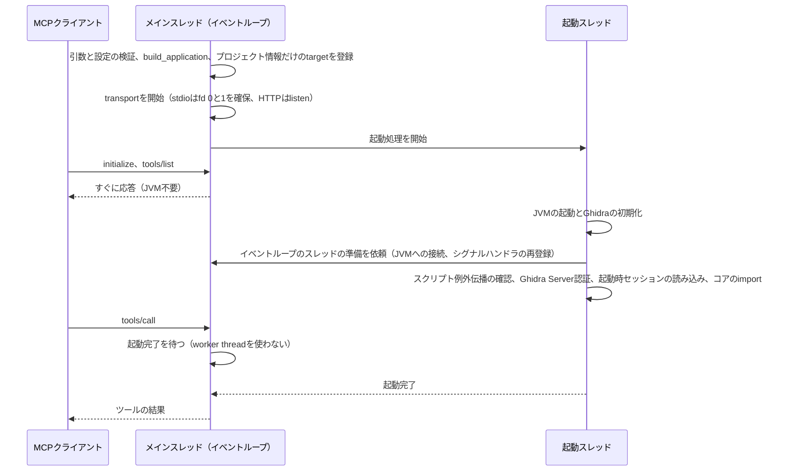

# MCPサーバーの起動時間を短縮する設計

2026-09-24作成、同日に第4節と第5節を実装した。基準コミット: `3c8e684`（`main`、未コミットの作業ツリーを含む）。起動経路を段階ごとに計測し、リポジトリ外の試作スクリプトで方式を検証したうえでまとめた**設計書**である。実装で設計から変えた点と実装後の計測は第12節にまとめた。2026-09-25に、シグナルの扱いを改めた。JVMを`-Xrs`で起動し、SIGINTとSIGHUPもSIGTERMと同じ後始末の経路に通す（第12.4節）。第4.3節と第6節のシグナルの記述は、設計時の調査の記録として残している。

## 1. 推奨する変更

起動の待ち時間の大半は、JVMとGhidraの初期化と、起動時に指定したプログラムの読み込みが占めている。どちらもMecha Ghidraの側からはほとんど短縮できない。そこで、MCPの受付をJVMより先に始め、Ghidraの起動をバックグラウンドで進める方式（以下、**受付先行起動**）を提案する。試作では、`--domain-path` でプログラムを1つ読み込むstdio構成で、`initialize` の応答が3.5秒から0.45秒になった。接続直後に呼んだツールの完了時刻も、3.6秒から3.3秒になった。

| 順序 | 変更 | 効果 | 変更範囲 |
| --- | --- | --- | --- |
| 1 | stdioでSIGTERMを受けたときに後始末がJVMに打ち切られる既存の不具合を直す（第6節） | 停止時の安全性。受付先行起動の前提にもなる | `cli.py` の数行とテスト |
| 2 | 起動時のツールスキーマ自己検査を待ち時間から外す（第5節） | defaultで0.37秒、fullで0.54秒の短縮 | `mcp_server.py` とテスト |
| 3 | 受付先行起動（第4節） | `initialize` の応答が2.4〜3.6秒から約0.45秒へ | CLI、transport、MCP層、launcher、エラーコード、文書、テスト |
| 4 | Dockerの既定プラットフォームをホストに合わせ、`JAVA_HOME_OVERRIDE` を設定する（第8節） | Apple Silicon上のamd64エミュレーションでは、PyGhidraの起動だけで約3.2倍の時間がかかる | Compose、ビルドスクリプト、Dockerfile、文書 |

受付先行起動は「Ghidraの起動が速くなる」ことを意味しない。JVMとGhidraの初期化にかかる時間はそのまま残り、その時間をクライアントの接続処理や最初の呼び出しまでの時間と重ねる。接続直後にツールを呼ぶと、その呼び出しはGhidraの起動完了まで待つ。

実装したのは順序1から3までである。順序1は、並行して進んだ長時間処理のジョブ化の作業で先に直された（当時の`_rearm_python_sigterm`）。受付先行起動では、その再登録をJVMの起動後にイベントループのスレッドで行う形に移した。2026-09-25からはJVMを`-Xrs`で起動するので、再登録は別の場所で起動したJVMへの備えとして残っている（`_rearm_python_signals`、第12.4節）。順序4のうち `JAVA_HOME_OVERRIDE` は、2026-09-25に実装した（第8節）。既定のプラットフォームは変えない（第9節）。

## 2. 計測結果

計測環境はApple M4 Max（macOS、Darwin 25.6.0）、Ghidra 12.1.4、Temurin JDK 21.0.8、Python 3.12.11、mcp 2.2.0、PyGhidra 3.2.0（固定したsnapshot）、JPype 1.5.2である。同じ時間帯に別のpytestも実行されていたため（Ghidraのログで確認）、値には0.1秒程度の揺れがある。

### 2.1 起動の各段階にかかる時間

現行の `_run_cli` と同じ順序で各段階を個別に呼び出し、プログラムを読み込まない構成で計測した。値は2〜3回の代表値である。

| 段階 | 時間 | 内訳と備考 |
| --- | --- | --- |
| Pythonモジュールのimport | 0.40秒 | うち0.24秒が `mcp` パッケージ。`mcp/__init__.py` がclient側のモジュールまで読み込む |
| `build_application` | 0.42秒 | うち0.37秒がスキーマ自己検査（114スキーマ）。検査を除くと0.05秒 |
| JDKの探索 | 0.11秒 | PyGhidraが `java -version` とLaunchSupportの2つの子JVMを起動する |
| `jpype.startJVM` | 0.13秒 | |
| Ghidra環境の準備 | 0.13秒 | `GhidraApplicationLayout` と `initializeGhidraEnvironment` |
| PyGhidraのplugin設定 | 0.24秒 | `setup_plugin`。PyGhidraスクリプトの実行に使う |
| `Application.initializeApplication` | 0.77秒 | うちGhidraのクラス探索（ClassSearcher）が0.55秒、残りがモジュール初期化 |
| 起動時セッションの読み込み | 1.25秒 | `--domain-path` で約150KBの `hello.bin` を開いた場合 |
| コアハンドラのimport | 0.10秒 | |

### 2.2 構成ごとの応答開始時間

プロセスの起動から `initialize` の応答までを、stdioで計測した。

| 構成 | `initialize` の応答 |
| --- | --- |
| `.venv/bin/mecha_ghidra`、default（55ツール） | 2.34〜2.42秒 |
| `uv run mecha_ghidra` | 2.67〜2.69秒（最初の1回は3.95秒） |
| `uv run --frozen --no-sync mecha_ghidra` | 2.40秒 |
| `--add-category scripts` | 2.55秒 |
| `--add-category scripts --script-root bundled`（310スクリプト） | 2.65秒 |
| `--tool-profile full`（81ツール） | 2.68秒 |
| `--domain-path /hello.bin` | 3.43〜3.60秒 |

### 2.3 コンテナとエミュレーション

コンテナの計測には、手元にあった既存のイメージを使った。コードは基準コミットより古い。amd64との比較は、Ghidra 12.1.2とPyGhidra 3.1.0を含む別のイメージで、PyGhidraの起動部分だけを測った。どちらも傾向を把握するための値である。

| 条件 | 結果 |
| --- | --- |
| arm64コンテナ、HTTP、プログラムなし | 2.9〜3.1秒。間を置いた後の最初の起動は5.9〜7.3秒 |
| 同、`--cpus 1` | 4.1秒 |
| PyGhidraの起動部分、arm64ネイティブ | 1.7〜2.2秒（JDK探索0.05秒、JVMとGhidraの初期化1.3〜1.7秒） |
| PyGhidraの起動部分、amd64エミュレーション | 5.3〜5.7秒（JDK探索0.6〜0.7秒、JVMとGhidraの初期化4.0〜4.4秒） |

CPU数を2に減らしても変化はなく（2.9〜3.1秒）、1にすると4.1秒になった。CPU数よりも、ファイルキャッシュが温まっているかどうかと、エミュレーションの有無のほうが大きく効く。

## 3. 短縮できる部分とできない部分

Python側の0.8秒のうち、スキーマ自己検査の0.37秒は取り除ける（第5節）。importの0.4秒は大半が `mcp` パッケージの初期化で、Mecha Ghidraの側からは変えられない。

JVMとGhidraの初期化（約1.4秒）は、ほとんどがGhidraとPyGhidraの内部処理である。クラス探索は全モジュールのjarを走査し、読み込むモジュールを減らす方法は公開されていない。PyGhidraのplugin設定は、PyGhidraスクリプトの実行に使う。省けるのはJDKの探索だけで、PyGhidraが対応している環境変数 `JAVA_HOME_OVERRIDE` を設定すれば、子JVMの起動が2回減る（ネイティブで0.11秒、エミュレーションで0.6〜0.7秒）。

ほかに2つの方法を試したが、効果はなかった。1つ目はクラスデータ共有（CDS）である。Ghidraの `launch.properties` は `-Xshare:off` を指定しており、`-Xshare:auto` で上書きしても短縮は計測できなかった。そのうえ、JVMが「`[warning][cds] Archived non-system classes are disabled because the java.system.class.loader property is specified`」をstdoutへ出力した。Ghidraが独自のシステムクラスローダーを使うためで、transportがfd 1を確保する前にこの行が出ると、stdioのプロトコルが壊れる。2つ目は、Pythonのimportとbuildを、別スレッドでのJVM起動と並行させる方法である。両者がGILを取り合ってimportが0.4秒から0.9秒に延び、全体は2.3秒から2.1秒にしか縮まなかった。

起動時セッションの読み込みは、プログラムの大きさと数に応じて延びると見込まれる（今回は約150KBの1本だけを計測した）。プログラムを開いておく必要がある以上、この時間は削れない。

削れる時間は合わせて0.5秒ほどで、残りの約2秒（プログラムを読み込む構成では約3秒）は削れない。この残りの時間をクライアントから見えなくするのが、受付先行起動である。

## 4. 受付先行起動の設計

### 4.1 起動の順序

起動処理を3つの段階に分ける。transportの開始前には、JVMを使わない検証とtargetの登録だけを行う。transportを開始したら、JVMを使う処理を起動スレッドへ任せ、メインスレッドのイベントループはすぐに要求を受け付ける。



transportの開始前に行う処理は、現状と同じく、失敗したら受付を始めずに終了する。対象は、引数、パス方針、ロックの待ち時間、スクリプトcatalogの初期化、Ghidraディレクトリの検証、PyGhidra launcherの構築とGhidraのバージョン確認、`--session` の構文、Ghidra Server認証の引数の組み合わせと環境変数の有無、プロジェクト情報だけのtargetの登録、targetが1つも指定されていない場合である。launcherの構築とバージョン確認は、現在は `start_headless_jvm` の中でJVMの起動と一緒に行っているので、分けて呼べるようにする。`register_target` はパスを扱うだけで、JVMを使わない。

起動スレッドは、JVMの起動（JDKの探索を含む）、シグナルハンドラの再登録、Javaの `System.out` のstderrへの付け替え、スクリプト例外伝播の確認、Ghidra Server認証の設定、起動時セッションの読み込み（引数の順）、コアのimportを順に行う。段階の間ごとに停止要求を確認する。完了したら、`Ghidra ready in 2.9 s (jvm 1.6 s, sessions 1.2 s)` のように所要時間をINFOで記録する。環境ごとに何秒かかっているかを、利用者がログで確かめられるようにするためである。

### 4.2 起動完了を待つ要求と待たない要求

`initialize`、`ping`、`tools/list`、`resources/list`、`resources/templates/list`、`resources/read` は、JVMを使わないので待たない。ツールの一覧と説明、`ghidra://docs/tools` はToolSpecから作られる。`ghidra://results/` は結果cacheを読むだけで、起動前は空である。

`tools/call` は、すべて起動完了を待つ。`list_targets` のようにJVMを使わないツールもあるが、起動スレッドが登録するtargetが揃う前に答えると一覧が欠けるので、例外は設けない。待機はイベントループ上で行い、worker threadを消費しない。

待機の上限には、既存の `--lock-timeout-seconds`（既定30秒）を使う。上限を超えたら再試行可能な `LOCK_TIMEOUT` を返し、既存の `details` の形に合わせて `lock` を `startup`、`timeout` を上限の秒数にする。新しいフラグは追加しない。`LOCK_TIMEOUT` の意味（使用中なので後で再試行する）は起動中にも当てはまり、クライアントの対応も変わらない。

起動を待った時間は、その後の待ち時間から差し引く。並行作業で、どの呼び出しも約50秒以内に応答する約束ができた（ジョブは `wait_seconds` 以内、それ以外は40秒で `deferred: true`）。起動待ちをそのまま足すと、この約束が破れて、60秒で打ち切るクライアントに届かなくなる。そこで、先送りの40秒は起動を待った分だけ短くし、ジョブの `wait_seconds` も待った秒数を切り捨てて減らす。

起動に失敗した後の呼び出しには、再試行できない新しいエラーコード（案: `STARTUP_FAILED`）を返し、`details` に失敗した段階と起動時のエラーメッセージを入れる。どちらのエラーも既存の `domain_error` の経路で返し、公開している出力スキーマのエラー形式に合わせる。試作では文字列の `ToolError` で返したが、本実装ではこの形は使わない。

### 4.3 検証で見つかったスレッドとシグナルの制約

JVMを作ったスレッドは、JVMに接続したまま終了させられない。試作の最初の版は、anyioのworker threadでJVMを起動しただけで、正常終了の時点でプロセスが停止した。JPypeがatexitで呼ぶ `DestroyJavaVM` が、JVMを作ったスレッドを非daemonのJavaスレッドとして数え続け、その終了を待つためである。jstackには、JVMを作ったスレッドにあたる `"main"` が残っていた（CPU時間は取得できず `-0.00ms` と表示された）。macOSでは `_JTerminate` で停止したまま手動で止めるまで終了せず、arm64のLinuxコンテナでも40秒のtimeoutまで終了しなかった。起動処理の最後に、JPypeの公開APIである `java.lang.Thread.detach()` でスレッドを切り離すと、両方の環境で正常に終了した。この規則は、JVMの起動に関する約束を集約している `ghidra_headless.launcher` に置く。起動が途中で失敗した場合も切り離すよう、`finally` で行う。

JVMの起動は、Pythonのシグナルハンドラも置き換える。JVMは作成時にSIGTERMのハンドラを登録し、それより前にPythonが登録したハンドラを上書きする。受付先行起動ではtransportのハンドラ（stdioでは `main()` のもの、HTTPではuvicornのもの）がJVMより先に登録されるので、両方のtransportが影響を受ける。試作のHTTP版でも、再登録しない場合はSIGTERMの0.39秒後に、後始末のログを出さずに終了した。そこで、JVMの起動直後に起動スレッドからメインスレッドへ依頼し（`anyio.from_thread.run_sync`）、その時点でPythonが持っているハンドラを `signal.signal` で登録し直す。JVMの作成からこの再登録までの約1秒間に届いたSIGTERMは、JVMが処理する。この時点ではまだプロジェクトを開いていないので、失われる後始末はスクリプトsnapshotの一時ディレクトリの削除などに限られる。設計の時点のstdioでは、この状態が起動後もずっと続いていた（第6節）。

（2026-09-25追記）この約1秒の抜けは、JVMを`-Xrs`で起動する形に改めてなくなった。`-Xrs`は、JVMを埋め込むプログラムのためのJVMの選択肢で、JVMはSIGTERM・SIGINT・SIGHUP・SIGQUITのハンドラを登録しない。起動中も含めて常にPythonがシグナルを受ける。上の再登録は、`-Xrs`なしに別の場所で起動したJVMへの備えとして残し、SIGINTとSIGHUPにも広げた（第12.4節）。

stdioの出力は、SDKが保護している。mcp 2.2.0の `stdio_server()` は、受付中はfd 1をstderrへ、fd 0を `/dev/null` へ付け替え、プロトコルには複製したfdを使う。起動スレッドはtransportがfdを確保した後に開始するので、JVMの出力がプロトコルの行に混ざらない。transportの終了後に出る出力に備えて、`redirect_java_stdout_to_stderr()` は残す。

JVMの起動とプログラムのオープンは、途中で中断できない。stdinのEOFやSIGTERMを受けたら停止要求を立て、起動スレッドは次の段階へ進む前に止まる。メインスレッドは、実行中の段階が終わるのを待ってから `close_all` を呼ぶ。試作で起動直後にstdinを閉じると、JVMの段階が終わった時点（2.75秒）で終了した。現状は、起動をすべて終えてから終了する（3.97秒）。

uvicornは、正常に停止した後でSIGTERMを再送し、それを受けた `main()` のハンドラが `SystemExit` を送出する。transportをanyioのTaskGroupの中で動かすと、この `SystemExit` が `BaseExceptionGroup` に包まれ、試作では終了コードが143ではなく1になった。本実装では起動スレッドをTaskGroupの外の通常のスレッドにし、transportのコードをほぼそのまま残したので、この問題は起きない。

実装の途中で、制約がさらに2つ見つかった。1つ目は、イベントループのスレッドをJVMに接続する時期である。並行作業では `cancel_operation` をイベントループのスレッドで動かし、その根拠を「このスレッドがJVMを起動したので、新しいJVMスレッドを作らない」としていた。スクリプトの実行中に新しく接続したスレッドは、スクリプトが起動した迷子のスレッドと判定され、対象が隔離されるためである。受付先行起動ではこの前提が崩れるので、JVMの起動直後のメインスレッドの段階で、シグナルの再登録と一緒に `attach_server_thread()` でこのスレッドを接続する。どのスクリプトよりも先に接続が済むので、判定を誤らせない。

2つ目は、`main()` のSIGTERMハンドラの競合である。stdio の結合テストを繰り返すと、16回に1回ほどSIGTERMの後にプロセスが止まった。スタックを採ると、`asyncio.run` の後片付けがタスクの終了を待ち続けていた。ハンドラはメインスレッドの任意の位置で例外を投げる。ワーカースレッドの結果をタスクへ渡すコールバックの途中で投げると、そのfutureが完了しないまま残り、後片付けが終わらない。これは受付先行起動の前からある競合で、通知を送った直後にSIGTERMを送る新しいテストで表に出た。イベントループの実行中に呼ばれた場合は、例外をその場で投げず、`call_soon_threadsafe` で独立したコールバックから投げる形に直した。修正後は60回続けて止まらなかった。2026-09-25からは、SIGINTとSIGHUPも同じハンドラで受ける。

### 4.4 起動に失敗したときの扱い

| 失敗の種類 | 現状 | 提案 |
| --- | --- | --- |
| 引数、パス方針、スクリプトroot、Ghidraディレクトリ、PyGhidraの構成、targetの指定なし | 受付前に1行のログを出し、終了コード1または2 | 同じ（受付前に検出する） |
| JVMの起動、スクリプト例外伝播の確認、Ghidra Server認証、起動時セッションの読み込み | 受付前に1行のログを出し、終了コード1 | 同じログを出し、開いたプロジェクトを閉じる。stdioは失敗状態のまま受付を続け、以後の `tools/call` に `STARTUP_FAILED` を返す。stdinが閉じたら終了コード1で終わる。HTTPは受付を止め、終了コード1で終わる |
| 起動中のSIGTERM | JVMの起動前はPythonが処理して143。起動後のstdioはJVMが即座に終了させる | 実行中の段階が終わるのを待ち、後始末をしてから143。2026-09-25からは、SIGINTとSIGHUPも同じく後始末をしてから130・129で終わる |
| 起動が終わらない | クライアントの接続がタイムアウトする | `initialize` は成功し、`tools/call` は上限を超えると `LOCK_TIMEOUT` |

stdioで失敗状態を続けるのは、終了させる方法がないためである。試作の最初の版は「起動に失敗したらtransportを止めて終了する」実装にしたが、クライアントがstdinを開いたままの通常の状況では、プロセスが終了しなかった。SDKはstdinを別スレッドで読んでおり、キャンセルしてもその読み取りは戻らない。応答も返らないので、クライアントからはサーバーが停止したように見える。失敗状態で受付を続ける版では、`initialize` が0.86秒で成功し、ツールの呼び出しは2.65秒で `Program not found: /does-not-exist` を含むエラーを受け取り、stdinを閉じると終了コード1で終わった。stderrにしか理由が出ない現状と比べて、LLMがエラーの理由を読める分だけ原因にたどり着きやすい。

HTTPはuvicornを正常に止められるので、現状と同じく終了させる。Composeの `restart: unless-stopped` などの監視と組み合わせたとき、失敗状態のまま稼働を続けるよりも、現状の挙動に近い。

### 4.5 変更するコード

- `presentation/cli.py`：`_run_cli` を、受付前の検証、起動処理、受付の3つに分ける。起動処理は段階の列として書き、段階の間ごとに停止要求を確認する。
- `presentation/transport.py`：`run_mcp_server` が起動処理を受け取り、transportの準備ができてから開始する。stdioは `stdio_server()` の中で、HTTPはuvicornと同じイベントループで動かす。
- `presentation/mcp_server.py`：`tools/call` の前に起動完了を待ち、待機の上限と失敗後のエラーを返す。
- `ghidra_headless/launcher.py`：メインスレッド以外から起動したときの `detach` を担う。launcherの構築とバージョン確認を、JVMの起動と分けて呼べるようにする。
- `domain/errors.py` と `domain/error_codes.py`：`STARTUP_FAILED` を追加する。
- 文書：`usage`、`clients`、`troubleshooting`、`tools`、`configuration`（日本語版と英語版）に、ツール一覧がすぐに得られること、最初の呼び出しが起動完了を待つこと、`Ghidra ready` のログ、失敗時の挙動を書く。

### 4.6 テスト

JVMを使わないテストでは、起動処理を偽物に差し替えて、遅延、失敗、完了しない場合を作る。確認するのは、`initialize` と `tools/list` が起動前に返ること、`tools/call` が完了まで待つこと、上限で `LOCK_TIMEOUT` になること、失敗後に `STARTUP_FAILED` を返すこと、起動中のEOFとSIGTERMで段階の境界で止まり `close_all` が1回だけ効くこと、である。`tests/test_cli_session.py` の起動順序のテストは、transportがJVMより先になる順序に書き換える。

JVMを使うテスト（`GHIDRA_RUNTIME_VALIDATION=1`）では、実際にバックグラウンドで起動し、timeoutを付けて正常に終了することを確かめる（detachの退行を検出するため）。stdioとHTTPのそれぞれで、起動後にSIGTERMを送り、遅くした `close_all` が最後まで走ることも確かめる。

### 4.7 期待できる効果

| 構成 | 現状 | 受付先行起動と自己検査の移動 | 根拠 |
| --- | --- | --- | --- |
| stdio、`--domain-path /hello.bin`、`initialize` | 3.43〜3.60秒 | 0.44〜0.47秒 | 試作で計測 |
| 同、接続直後に呼んだツールの完了 | 3.56〜3.63秒 | 3.30〜3.35秒 | 試作で計測 |
| HTTP、同じ構成、`initialize` | 3.77秒 | 0.44〜0.50秒 | 試作で計測 |
| HTTP、接続直後に呼んだツールの完了 | 3.80秒 | 3.21〜3.22秒 | 試作で計測 |
| stdio、default、プログラムなし、`initialize` | 2.34〜2.42秒 | 約0.45秒 | 推定。応答までの処理は `--domain-path` の有無で変わらない |
| amd64エミュレーションのコンテナ、`initialize` | 未計測（PyGhidraの起動部分だけで5.3〜5.7秒） | 1秒未満 | 推定。Python側の処理がエミュレーションで約1.7倍になるとして計算 |

最初のツール呼び出しが、接続からGhidraの起動完了まで（試作で約3秒）より後であれば、待ち時間は生じない。

## 5. ツールスキーマの自己検査を待ち時間から外す

`GhidraMCPServer` は構築時に、公開する全ツールの入力と出力のスキーマを `Draft202012Validator.check_schema` で検査している。v1.0の強化で、不正な公開契約を最初の呼び出しではなく起動時に見つけるために入れたものである。この検査が `build_application` の約9割を占め、defaultで0.37秒（114スキーマ）、fullで0.54秒（162スキーマ）かかる。同一のスキーマを除いても107件と154件で、時間はほとんど変わらなかった。プロファイルでは、2020-12メタスキーマの `$dynamicRef` と参照の解決が大半を占めた。

公開するスキーマは、ツールの定義と `--large-result-mode` だけで決まる。`--tool-description-mode` を変えてもスキーマは変わらず、profileや個別の有効化でツールごとのスキーマが変わることもなかった（`batch_read` を含めて確認した）。`inline` は、結果を参照する2つのツール（`read_result` と `search_result`）を公開しないだけである。したがって、full profileを `resource` と `inline` の両方で構築し、全bindingのスキーマを検査するJVM不要のテストを置けば、起動時の検査と同じ範囲を確かめられる。出力の検証器（`Draft202012Validator(schema)`）の構築は安価なので、起動時に残す。

移し先は2つある。1つ目はテストへ移す方法で、受付先行起動を採用しなくても単独で効く。ただし、ロックファイルを使わずに導入した環境では、pydanticの版の違いでスキーマの生成結果が変わる可能性があり、その検出は利用者の環境では行われなくなる。2つ目は、受付先行起動の起動処理の中へ移す方法である。利用者の環境での検出を残したまま `initialize` の待ち時間からは外れるが、最初のツール呼び出しが検査の分（defaultで約0.37秒）だけ遅くなる。検査で見つかるのは主にMecha Ghidra自身が組み立てたスキーマの誤りで、それはテストで検出できる。このため、1つ目を推奨する。どちらも、以前に意図して入れた起動時の検査を外す変更である。

## 6. 既存の不具合：stdioでSIGTERMを受けると後始末がJVMに打ち切られる

調査の途中で、受付先行起動とは独立した不具合を見つけた。`main()` はSIGTERMで `SystemExit` を送出し、後始末（`close_all` など）を実行する設計になっている。しかしstdioでは、JVMの起動後にこのハンドラが働かない。第4.3節で述べたとおり、JVMがSIGTERMのハンドラを置き換えるためである。HTTPでは、uvicornがJVMの起動後に自分のハンドラを登録し、停止後に元のハンドラを登録し直すので、この問題は起きない。

計測では、stdioで起動した後にSIGTERMを送ると、Pythonの `SystemExit` は発生せず、JVMの終了処理と `close_all` が並行して走った。`close_all` に2秒の遅延を入れると、SIGTERMの0.40秒後にプロセスが終了し、`close_all` は完了しなかった。arm64のLinuxコンテナで同じ順序の最小スクリプトを動かすと、JVMの起動後に送ったSIGTERMでは、Pythonのハンドラも `finally` も実行されなかった。インポート解析のロールバックやプロジェクトのクローズが、途中で打ち切られる可能性がある。

修正は、JVMの起動直後にメインスレッドでSIGTERMのハンドラを登録し直すことである。

```python
_start_pyghidra_headless(ghidra_path or None)
if threading.current_thread() is threading.main_thread():
    # Starting the JVM replaced the SIGTERM handler; re-arm the Python one.
    signal.signal(signal.SIGTERM, signal.getsignal(signal.SIGTERM))
```

同じ計測で、再登録した版は遅くした `close_all` を最後まで実行し、SIGTERMの2.10秒後に終了コード143で終わった。受付先行起動を採用するかどうかにかかわらず、先に入れられる。JVMを使うテストで、遅い `close_all` とSIGTERMの組み合わせを確かめる。SIGINTの挙動は今回確認していない。

この修正は、並行作業で `_rearm_python_sigterm` として先に入り、JVMを使うテスト（`test_real_stdio_sigterm_runs_cleanup_before_the_process_ends`）も追加された。受付先行起動ではJVMが起動スレッドで起動するので、上のコードのようにJVMの起動直後に同じスレッドで再登録することはできない。起動スレッドからイベントループのスレッドへ依頼して行う（第4.3節）。

（2026-09-25追記）その後、SIGINTとSIGHUPにも同じ問題があるとわかり、直した。JVMの起動後は、どちらもJVMが後始末をせずに終わらせていた。JVMの起動前のSIGINTは、stdinが開いたままだとプロセスが終わらなかった。今は、JVMを`-Xrs`で起動し、3つのシグナルとも`main()`の同じハンドラで受ける。再登録の関数は`_rearm_python_signals`に改名し、テストは`test_real_stdio_shutdown_signal_runs_cleanup_before_the_process_ends`として3つのシグナルで流す（第12.4節）。

## 7. 採用しない案

| 案 | 見送る理由 |
| --- | --- |
| `-Xshare:auto` でCDSを有効にする | 計測で短縮が見られず、CDSの警告がstdoutに出る（第3節） |
| JITの設定を変える（`-XX:TieredStopAtLevel=1` など） | 起動は速くなりうるが、長時間動く解析サーバーの処理速度が落ちる。今回は計測していない |
| Ghidraのモジュールを減らす、単一jarで動かす | PyGhidraの公開APIが対応しておらず、Ghidraの版を上げるたびに壊れる恐れがある |
| `setup_plugin` を省く | PyGhidraの内部に依存し、PyGhidraスクリプトが動かなくなる |
| Pythonのimportと JVMの起動を並行させる | GILを取り合い、0.2秒しか縮まなかった（第3節） |
| JVMだけメインスレッドで作り、Ghidraの初期化を別スレッドで行う（`DeferredPyGhidraLauncher`） | 公開APIだけで済むが、受付前に約0.7秒が残る。detachで同じ問題を解消できる |
| イベントループを別スレッドへ移し、メインスレッドでJVMを起動する | detachは不要になるが、停止処理とシグナル処理の経路を大きく作り直すことになる |
| 最初のツール呼び出しでJVMを起動する | 接続後の時間と起動を重ねられず、最初の呼び出しがその分だけ遅くなる |
| JVMを常駐させる別プロセスを用意する | 起動を1回で済ませる目的なら、長時間動くHTTPサーバーに複数のクライアントを接続する既存の構成で足りる |

## 8. Dockerと起動コマンドの調整

`docker-compose.yml` と `build_docker_image.sh` は、`DOCKER_PLATFORM` が未設定のとき `linux/amd64` を使う。Apple Siliconでこの既定のまま動かすとエミュレーションになり、PyGhidraの起動部分だけで約3.2倍の時間がかかる（第2.3節）。起動後の解析やデコンパイルも遅くなると見込まれるが、計測はしていない。既定をホストのプラットフォームに合わせ（Composeの `platform` を指定せず、Dockerfileの `TARGETARCH` による分岐に任せる）、amd64が必要な場合だけ `DOCKER_PLATFORM` で指定する形を提案する。arm64のイメージは、mecha_ghidraのリリースで配布しているデコンパイラのネイティブバイナリに依存するので、その配布を続けることが前提になる。

PyGhidraは、環境変数 `JAVA_HOME_OVERRIDE` があるとJDKの探索を省く。Dockerfileでは導入するJDKが決まっているので、アーキテクチャに依存しないパスへのsymlinkをビルド時に作り、そのパスを設定する。短縮はネイティブで0.05秒、エミュレーションで0.6〜0.7秒である。

（2026-09-25追記）実装した。Dockerfileで、aptで導入したJDKを `/opt/java` にリンクし、`JAVA_HOME_OVERRIDE=/opt/java` を設定する。arm64のイメージでは、PyGhidraのJDKの探索が0.080秒から0.000秒になった。リンクを作る段階は依存パッケージの導入の後に置いたので、この変更でGhidraや依存パッケージの層のキャッシュは無効にならない。

stdioの起動コマンドでは、`uv run` が起動のたびに環境の同期を確認し、0.3秒（最初の1回は約1.5秒）かかる。`uv run --frozen --no-sync` やvenvの `mecha_ghidra` を直接指定すれば省けるが、依存を更新したときに `uv sync` を手動で実行する必要がある。このため、文書で選択肢として示すにとどめる。

起動を1回で済ませたい場合は、HTTPで長時間動かし、複数のクライアントを接続する構成（`docs/usage` の既定例）を勧める。stdioでは、クライアントのセッションごとにJVMを起動する。

## 9. 決めた内容

設計の時点で残していた5つの点は、すべて推奨した案で実装した。

1. 起動後に失敗したときの扱い（第4.4節）。stdioは失敗状態のまま受付を続け、HTTPは受付を止めて終了コード1で終わる。
2. 起動待ちが上限を超えたときのエラー（第4.2節）。既存の `LOCK_TIMEOUT` を使い、`details.lock` を `startup` にする。
3. スキーマ自己検査の移し先（第5節）。テスト（`tests/test_mcp_server_construction.py`）へ移した。
4. JDKの誤りを受付前に検出するか。検出しない。JDKの探索は起動スレッドで行う。
5. Dockerの既定プラットフォーム（第8節）。変えない。

## 10. 実装の順序

1. 第6節の不具合の修正。並行作業で実装済み。
2. スキーマ自己検査の移動。実装済み。
3. 受付先行起動。実装済み。
4. Dockerの調整。`JAVA_HOME_OVERRIDE` は2026-09-25に実装した。既定のプラットフォームは、第9節のとおり変えない。

## 11. 設計時の確認範囲

- 計測と試作は、macOS（Apple M4 Max）のネイティブ環境で行った。detachとSIGTERMの挙動は、arm64のLinuxコンテナでも最小のスクリプトで確認した。
- 試作はCLIをimportして起動順序だけを組み替えたもので、リポジトリ外に置いた。
- Windows、x86-64のLinuxホスト、起動時に共有プロジェクト（Ghidra Server）を開く構成、BSimは確認していない。共有プロジェクトでは起動時セッションの読み込みがネットワークに依存するので、受付先行起動の効果はさらに大きくなると見込まれるが、計測はしていない。
- amd64エミュレーションでは、PyGhidraの起動部分だけを別のイメージ（Ghidra 12.1.2、PyGhidra 3.1.0）で計測した。Mecha Ghidra全体の起動時間は計測していない。

## 12. 実装の結果

### 12.1 設計から変えた点

- 起動待ちの状態（`StartupGate`）と起動の段階を順に動かす処理（`BackgroundStartup`）は、新しいモジュール `presentation/startup.py` に置いた。
- 起動待ちの上限を超えたときの `details` は、既存の形に合わせて `lock: "startup"` と `timeout` にした（第4.2節）。
- 起動を待った時間を、40秒の先送りとジョブの `wait_seconds` から差し引く（第4.2節）。設計の後に入ったジョブ化の作業の約束（約50秒以内の応答）に合わせた。
- イベントループのスレッドを、JVMの起動直後にJVMへ接続する（第4.3節）。ジョブ化の作業で `cancel_operation` がこのスレッドでJavaを呼ぶようになったためである。
- `main()` のSIGTERMハンドラは、イベントループの実行中なら独立したコールバックから例外を投げる（第4.3節）。
- 起動スレッドはanyioのTaskGroupではなく通常のスレッドにした。イベントループのスレッドで動かす段階は `call_soon_threadsafe` で依頼し、起動スレッドはその完了を待つ。ループが先に終わっていれば、起動をその場で止める。
- Ghidra Server認証の引数の検査（`_ghidra_server_credentials`）と、プロジェクト情報だけのtargetの登録を、受付の前に移した。

### 12.2 実装後の計測

第2節と同じ環境と計測スクリプトで、本物のCLIを3回ずつ起動した。

| 構成 | 実装前 | 実装後 |
| --- | --- | --- |
| stdio、プログラムなし、`initialize` | 2.34〜2.42秒 | 0.45〜0.61秒 |
| 同、接続直後に呼んだ `list_targets` の完了 | （2.4秒の後に呼ぶ） | 2.08〜2.35秒 |
| stdio、`--domain-path /hello.bin`、`initialize` | 3.43〜3.60秒 | 0.46〜0.48秒 |
| 同、接続直後に呼んだ `get_program_info` の完了 | 3.56〜3.63秒 | 3.27〜3.37秒 |
| HTTP、`--domain-path /hello.bin`、`initialize` | 3.77秒 | 0.50〜0.55秒 |
| 同、接続直後に呼んだ `get_program_info` の完了 | 3.80秒 | 3.40〜3.46秒 |
| HTTP、SIGTERMから終了まで | 0.61秒（終了コード143） | 0.55〜0.61秒（終了コード143） |

### 12.3 テスト

- JVMを使わないテストは、`tests/test_startup.py`（起動待ち、起動の段階、MCP層での待ち方）と `tests/test_startup_stdio.py`（本物のCLIとstdioをサブプロセスで動かし、JVMの起動だけを時間のかかる偽物にした結合テスト）を追加した。`tests/test_cli_session.py` の起動と終了のテストは、受付の開始がJVMより先になる順序に書き換えた。
- JVMを使うテスト（`GHIDRA_RUNTIME_VALIDATION=1`、`GHIDRA_RUNTIME_BINARY_PATH=/bin/ls`）は、共有プロジェクトのテストを除く `tests/test_runtime_*.py` がすべて通った。stdioとHTTPの実transportのテスト、stdioでのSIGTERMの後始末のテストも含む。Jython、BSim、PEの検体、Ghidra Serverが必要なテストは、それぞれの条件がないため実行していない。同日、使い捨てのGhidra Server・H2のBSimデータベース・Jython拡張を用意して流し、PEの検体が必要な1件を除いてすべて通った。

### 12.4 シグナルの扱いの改訂（2026-09-25）

第4.3節と第6節で残した制限を、次のように直した。

| 項目 | 変更前 | 変更後 |
| --- | --- | --- |
| JVMの起動中に届いたシグナル | JVMが処理し、後始末をせずに終わる | JVMを`-Xrs`で起動する。JVMはシグナルのハンドラを登録しないので、常にPythonが受ける。`jcmd`と`jstack`は、JVMが起動時に接続の受け口を用意するので、そのまま使える |
| SIGINT | JVMの起動後はJVMが後始末なしで終わらせる。起動前はstdinが開いたままだと終わらない | `main()`がSIGTERMと同じハンドラで受け、後始末をして130で終わる |
| SIGHUP | JVMが後始末なしで終わらせる | 同じハンドラで受け、129で終わる。HTTPでは、uvicornがSIGINTとSIGTERMにだけ行う穏やかな停止（受付中の要求を終えてから止まる）を、SIGHUPにも行う（`transport._graceful_hangup`） |
| SIGQUIT（`kill -3`） | JVMがJavaのスレッドダンプを出す | `-Xrs`のままでは既定の動作でプロセスが終わるので、Pythonの全スレッドのスタックを出して動き続ける（`faulthandler`） |

親のプロセスが無視にしたシグナル（nohupのSIGHUPなど）は、無視のままにする。起動後にハンドラを登録し直す処理は、`-Xrs`なしに別の場所で起動したJVMへの備えとして残し、3つのシグナルに広げた。

JVMを使うテストで、次を確かめた。

- 3つのシグナルのそれぞれで、遅くした`close_all`が最後まで走ってから終わる
- JVMの起動の段階を止めている間に届いたSIGTERMを、Pythonが受ける

`-Xrs`を外すと、後者のテストが失敗する。
